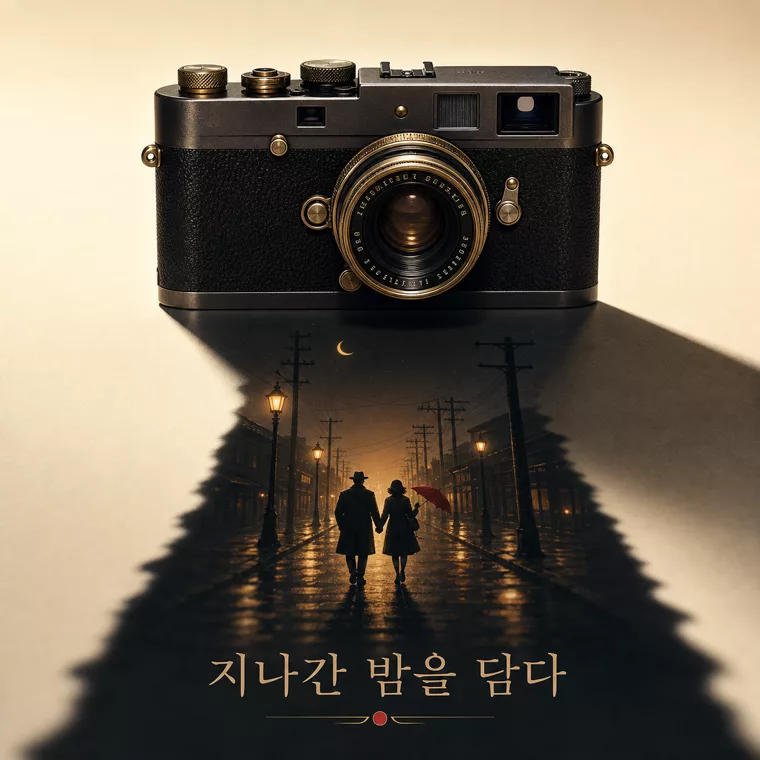
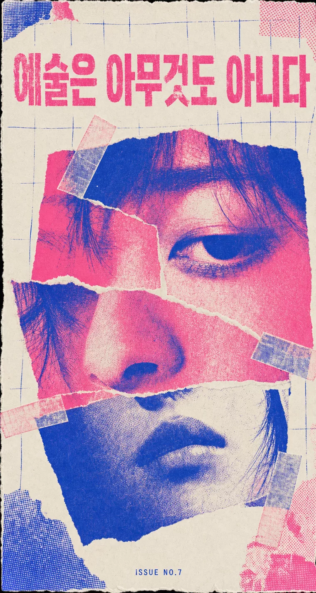
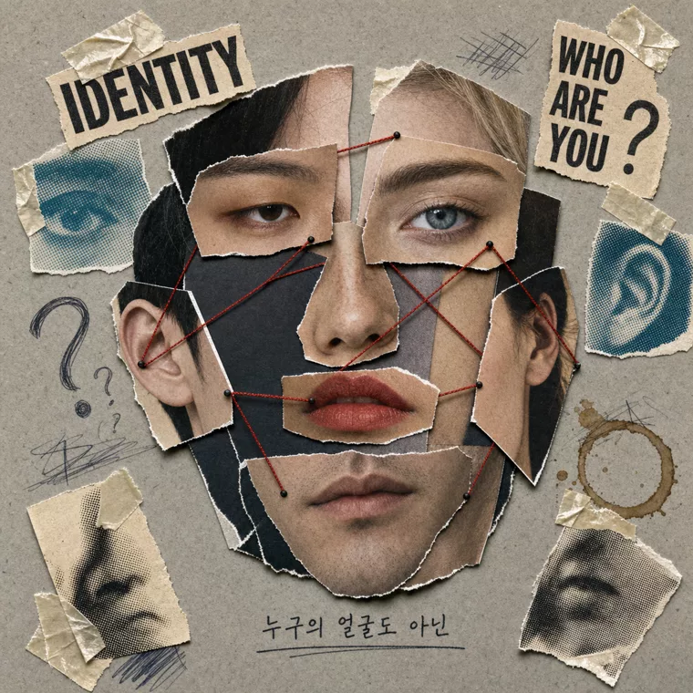
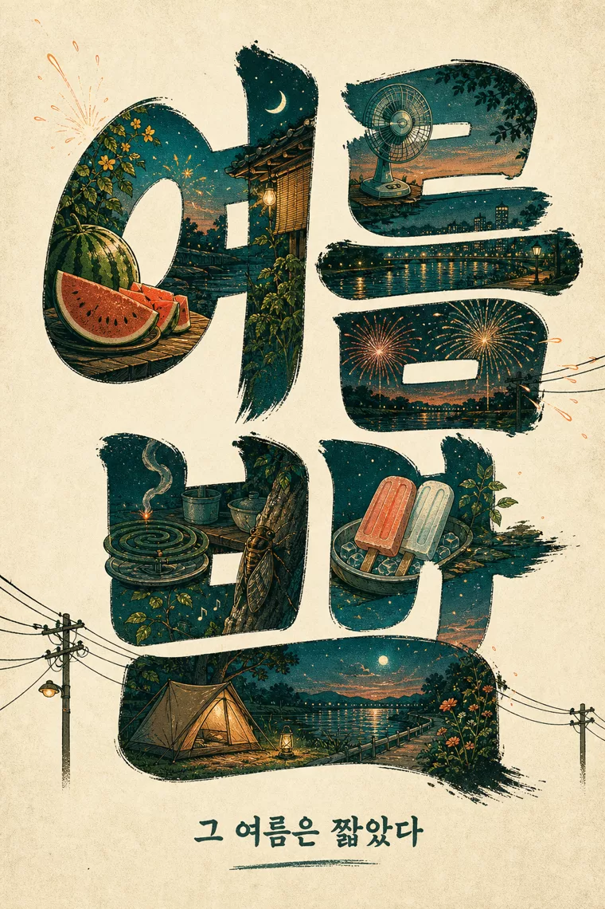

# 🐾 ゴンニャン・プロンプトキット VOL.2

**曖昧なひと言を、そのまま生成に使える gpt-image-2 プロンプトへコンパイルする Claude Code スキル。**

<samp>[한국어](README.md) · [English](README.en.md) · **日本語**</samp>

[](LICENSE) &nbsp; &nbsp; &nbsp;


「ポスターを1枚作って」程度のリクエストを受け取り、そのまま生成に投入できる完成度の韓国語プロダクションプロンプトを返す。ルールは約1,000枚規模のライブラリ（エディトリアル・ポスター・漫画）を作りながら検証し、ひとつのスキルにまとめた。上のキービジュアルも、このキットがコンパイルしたプロンプト（C11 シネマティック・キーアート）から生成したものだ。

> インタラクティブ・デモ：**[kimsh-1.github.io/gongnyang-prompt-kit](https://kimsh-1.github.io/gongnyang-prompt-kit)**

## クイックスタート

```bash
git clone https://github.com/kimsh-1/gongnyang-prompt-kit
ln -s "$PWD/gongnyang-prompt-kit/skills/image-prompt" ~/.claude/skills/image-prompt
```

Claude Code で「画像プロンプトを書いて」「エディトリアル・プロンプト」「キーアート」などのトリガー、または `/image-prompt` で実行する。

- シンボリックリンクで導入すればリポジトリの更新が自動反映される。コピーで導入した場合は更新のたびに再コピーが必要。
- バリデーターの実行には Node.js が必要。

## 何をするか


曖昧なリクエスト → 完成プロンプト → バリデーター通過。この3ステップがスキルの中で完結する。

| 入力 | 出力 |
|---|---|
| 「春の夜の夜市ポスターを1枚」 | シーン・カメラ・照明・パレット（HEX）・テキスト配置まで指定された完成プロンプト + `AR 4:5` |

画像生成そのものはこのスキルの範囲外。大量生成・並列スポーンは [codex-fleet](https://github.com/kimsh-1/codex-fleet) の `codex-imagegen` スキルを、1枚なら `codex` に直接投入する。（生成には [Codex CLI](https://github.com/openai/codex) のログイン + ChatGPT Plus/Pro が必要。）

## ビフォー / アフター — 同じリクエスト、同じモデル

違いは**プロンプトだけ**。左は人間のひと言をそのまま投入した結果、右は同じひと言をキットがコンパイルして投入した結果 — 同じ gpt-image-2 だ。キットが出力するのは**韓国語**のプロダクションプロンプト（韓国語レンダリングを第一に設計）なので、以下のコンパイル済みプロンプトは生成そのままの韓国語で示す。コンパイル済みプロンプトの全セットは [`examples/showcase.jsonl`](examples/showcase.jsonl) にある。

<details>
<summary>フラッグシップ — <code>かっこいい画像を1枚</code> → C11 シネマティック・キーアート（コンパイル済みプロンプト全文）</summary>

| スキルなし | キット・コンパイル |
|---|---|
|  |  |

```
시네마틱 키아트 — 새벽 구름바다 위로 도약하는 거대 고래.
Scene: 해 뜨기 직전의 구름 바다, 그 위로 거대한 혹등고래 한 마리가 구름 물보라를 흩뿌리며 도약하는 순간, 아래 절벽 끝에 작은 관측자 실루엣 한 명, 상단 하늘 밴드는 비워둔 클린 영역.
Camera: 초광각 vista, 로우 앵글, 인물 대비 압도적 스케일 대비, deep aerial perspective.
Lighting: 지평선의 골드 백라이트가 고래의 림을 태우고, 구름 틈으로 volumetric 광선이 쏟아진다.
Color grading: 새벽 인디고 #1B2440, 골드 #E8B168, 페일 로즈 #E8C4C4.
Texture/Medium: cinematic grain, 옅은 안개 드리프트.
AR 16:9
```

</details>

以下の各ペアは同じひと言。左は素のまま、右はキット・コンパイル：

| リクエスト → プレイブック | スキルなし | キット・コンパイル |
|---|---|---|
| `ファッション・スプレッド` → C1 エディトリアル |  |  |
| `リップバーム広告カット` → C2 ビューティ |  |  |
| `ジャズバーのポスター` → C3 韓国語ポスター |  |  |
| `イヤホン分解図鑑` → C4 プロダクト図鑑 |  |  |
| `香水キャンペーン` → C5 キャンペーン |  |  |
| `コーヒーのインフォグラフィック` → C6 インフォグラフィック |  |  |
| `節約カードニュース` → C7 カードニュース |  |  |
| `グラノーラのパッケージ` → C8 ブランディング・モックアップ |  |  |
| `ロケットの3Dアイコン` → C9 3Dアイコン |  |  |
| `猫の4コマ漫画` → C10 漫画 |  |  |
| `SFキーアート` → C11 キーアート |  |  |
| `高級腕時計` → L1 ラグジュアリー・エディトリアル |  |  |
| `ダッシュボード・ヒーロー` → L5 ダークテック |  |  |
| `年末の招待状` → L8 ゴールドフォイル |  |  |
| `波のタイポグラフィ・ポスター` → T1 動きの翻訳 |  |  |
| `夜市ポスター、ヒップでキッチュに` → T3 意図的な歪み |  |  |
| `ウイスキー広告、高級に` → M2 アールデコ |  |  |
| `ロックフェスのポスター` → M8 構成主義 |  |  |
| `キャンドル・ブランドのポスター` → M7 アールヌーヴォー |  |  |
| `エレクトロニック・パーティのポスター` → M9 サイケデリック |  |  |

## プレゼン・デッキ／複雑な図表（C6·C12）— 40カット・ギャラリー

ポスターやエディトリアルだけでなく、**発表スライドや複雑な概念図**もこのキットでコンパイルする。「gpt-image-2 は図表を描けない」という通念を40カットで反証した — シーケンス図、多対多ネットワーク、フィードバックループ、そして**1スライドあたり韓国語400〜800文字の超高密度テキスト**まで。

| 超高密度テキスト（Transformer, 約700字） | キャッシュ戦略5種の比較表（約700字） |
|---|---|
|  |  |
| **TCP シーケンス図（ライフライン・交差メッセージ）** | **21:9 データスライド（目盛り・値ラベル）** |
|  |  |

**40カット全ギャラリー → [`examples/diagram-gallery/`](examples/diagram-gallery/)**（インフォグラフィック・21:9デッキ・複雑な概念図・超高密度テキスト 各10カット + 元プロンプト jsonl）。

図表を開く3つのレバー：

- **テキスト精度の第一レバーはキャンバスの縦の高さ。** 21:9（codex 経路で縦 約810px）は400字で文字が小さくなる。16:9（約950px）・2:3 で縦を確保すれば700〜800字も鮮明。codex 経路は大きなキャンバス要求を長辺 約1900px に正規化するため、精度はアスペクト比の選択で稼ぐ。
- **フリーライト・ゾーンが密度の主武器。** クリティカルなラベルだけを引用符で固定し、本文は `genuine Korean sentences, fully written in real hangul` に委任すれば、モデルが概念的に正しい説明を自ら埋める（B木のキー分配・Raft ログインデックスまで論理整合）。
- **シーケンス・多対多・フィードバックも正面突破できる。** ボトルネックはモデルの能力ではなく、ノード・接続・方向を文でどれだけ具体的に指定するかだ。

> 💡 超高密度テキストのスライドは縦の高いアスペクト比（16:9 · 2:3）で最も安定する。タイトルや主要数値などクリティカルなコピーは引用符で固定し、本文の密度はフリーライト・ゾーンに委任して、必要なカットだけ取り直す。

## 販促グラフィック（P1–P8）— デザイナー・ポスターの文法

情報系SNSカードのカードニュース感ではなく、**実際のデザイナーが作った販促物**のトーンでレンダリングするレイヤー。デザイナーのリファレンス14枚から蒸留した8つのレイアウト文法（P1–P8）— 文字が装飾ではなく被写体と物理的に絡み合う構造 + 2〜3色のハードロック + 印刷仕上げのデバイス（バーコード・トンボ・エディション番号）。ルックプリセット（L）と直交し、互いに掛け合わせ（クロスブリード）できる。詳細は [`skills/image-prompt/references/promo-router.md`](skills/image-prompt/references/promo-router.md)（パターン別ドロップインは [`references/promo/`](skills/image-prompt/references/promo/)）。

### 基本パターン（P1–P8）

| P1 タイポマスク・文字の中の写真 | P2 タイポ環境・アイソメトリック地形 | P3 オーバーサイズ・クロップ + オクルージョン |
|---|---|---|
|  |  |  |
| **P5 メタUI・選択ボックス** | **P6 ストリート・コラージュ** | **P8 モノクローム・ステージング** |
|  |  |  |

### クロスブリード・韓国語ベース

パターンを2〜3個掛け合わせ、韓国語ヘッドラインで立てたセット。

| オクルージョン × 影のナラティブ（C11）・「집」 | マスキング × タイポ環境・「폭풍」 | 光の柱 × ステージング・「고요」 |
|---|---|---|
|  |  |  |
| **マスキング × 選択・「소리」** | **回転軸 × マスキング・「바다」** | **文字＝本棚・「책방」** |
|  |  |  |

韓国語ヘッドラインは**マスキング・押し出しともに2文字が安全圏**（3文字以上は画が潰れやすい）、オクルージョンは `reads behind it` の一文で成立する。

## ホンデ・インディーのムードライン（L9）— ホンデ病ギャラリー

「かっこいい」という感覚を勘ではなく**8つの生成エンジン**に分解したホンデ・インディーのムードライン（ルックプリセット L9）。一語を世界へ開くタイポグラフィ（A）、芸術運動の再解釈（B）、コラージュ（C）、フィルム写真（D）、Riso ジン・ポスター（E）、ミクストメディア（F）、静物（G）、そしてオブジェの落とす影がシネマティックな場面へにじむ**影のナラティブ（H）** — 同じムードを8通りに引き出す。影のナラティブはスキルの `shadow_narrative`（C11）文法と直結する。

| H・影のナラティブ（フィルムカメラ） | A・語の世界（夜明け） | D・フィルム（夜） |
|---|---|---|
|  |  |  |
| **B・芸術運動（サイケデリック）** | **E・Riso ジン（ポスター）** | **C・コラージュ（メンフィス）** |
|  |  |  |
| **G・静物（わびさび）** | **F・ミクストメディア（顔モンタージュ）** | **D・フィルム（屋台）** |
|  |  |  |
| **H・影のナラティブ（ウイスキーグラス）** | **A・語の世界（夏の夜）** | **D・フィルム（地下クラブ）** |
|  |  |  |

韓国語コピーは全カットでクリーンにレンダリングされる — 影のナラティブ（H）は、オブジェから影へ物語が開くシネマティック・キーアートで3語の韓国語スローガンまで正確だ。ルックプリセットのドロップインは [`skills/image-prompt/references/look-presets.md`](skills/image-prompt/references/look-presets.md)。

## コアルール

うまく出すためのルールではなく、**うまく出ないクセを止める**ルールだ。

| ルール | 理由 |
|---|---|
| **ネガティブは既定で禁止** | gpt-image-2 は "no crowd" のようなシーンネガティブを、まさにその単語でレンダリングする。シーンの除外はすべて肯定形で — 「フレーム内に人物1人、単独」。 |
| **例外はホワイトリスト2種のみ** | Tier-1 テキストレンダー・ガード（`no duplicate text` など7種、レンダーテキストがある時のみ）・Tier-2 エディトリアル・コンプライアンス・ペア（明示宣言時のみ）。それ以外の否定文はすべてバリデーターが捕捉する。 |
| **先頭ブラケット禁止** | サイズは API パラメータ。プロンプトには末尾に `AR x:y` トークンを1つだけ置く。 |
| **文字配置はゾーン文法** | 「上部1/3のタイトルバンド」、ロールラベル（headline/subhead/callout）、引用符でコピーを固定。高密度テキストは quality high とペアリング。 |
| **機材スペック → 結果の記述** | モデルは `Canon R5 f/1.4` を知らない。「shallow DoF, background falls off softly」のように結果で書く。 |
| **SD 品質タグ・死語禁止** | `masterpiece, 8k` もノイズ、「きれいに・高級に・アワード級に」もノイズ。基準がプロンプトの外にあると平均値しか出ない — 数値・身体反応・具体例に還元する。 |
| **数値を打ち込む** | HEX パレット、ケルビン、`key:fill 1:2` — 数値が品質を上げる。 |
| **1行 = 1カット = 1コール** | 1つのキャンバスに複数カットをグリッドで描かない。（カードニュースのようにグリッド自体が成果物の場合のみ例外。） |

## 2つのフォーマット

| | Format A — ラベル付き6セクション | Format B — エディトリアル・フラットコンマ |
|---|---|---|
| **構造** | Scene / Camera / Lighting / Color grading / Texture / Text-in-image | 被写体→顔→髪→ジャンルアンカー→シーン→衣装→構図→照明→パレット `#HEX`→質感 をコンマで繋いだ一文 |
| **用途** | ポスター・キーアート・インフォグラフィック・図鑑など構造物全般 | 単独人物のエディトリアル専用 |

## カテゴリ C1–C12

ファッション/エディトリアル・ビューティ・韓国語ポスター・プロダクト図鑑・キャンペーン・インフォグラフィック・カードニュース・ブランディング・モックアップ・3Dアイコン・漫画/ウェブトゥーン・シネマティック・キーアート・**プレゼンデッキ（新規）**。カットタイプと既定 AR は `references/category-patterns.md` にある。

「高級に見せる」は勘で組まない — `references/look-presets.md` の**ルックプリセット9種**（ラグジュアリー・エディトリアル・シネマティック・グレード・ミニマル・プロダクト・スイス・タイポグラフィ・ダークテック・レトロ印刷・パステル・ゴールドフォイル・ホンデ・インディー）から選んでドロップインする。

複数の案を広げる、あるいは概念から立てるときは `references/concept-axes.md` の**変数軸**を使う — 美学運動10種（バウハウス〜わびさび、造形言語に分解したドロップイン）、身体反応の翻訳（「高級に」ではなく「声を落として静かに見てしまう」）、矛盾ペアのレイヤー分離、音楽・場面→色の翻訳、タイポグラフィ・アート4技法（上の[ビフォー/アフター](#ビフォー--アフター--同じリクエスト同じモデル)の T1・T3 が実物）。同じ被写体を1軸でスイープすれば量産コンセプト案になる。

## バリデーター

書いたプロンプトがルールを守ったかを自動で検査する。ティアを認識し、ホワイトリスト外のネガティブだけを捕捉する。

```bash
node skills/image-prompt/scripts/check_prompt.mjs examples/poster.txt      # テキストモード
node skills/image-prompt/scripts/check_prompt.mjs --tier 2 examples/hwabo_formatB.txt
node skills/image-prompt/scripts/check_prompt.mjs --jsonl examples/prompts.sample.jsonl
node skills/image-prompt/scripts/check_prompt.mjs --test                   # 回帰セルフテスト
```

`{ok, format, tier, errors, warnings}` の JSON を返す。ホワイトリスト外のネガティブ・先頭ブラケット・SD 廃語・サイズロック違反・スロットトークンの残存は `error`（肯定形リライトのヒント付き）、空の形容詞・HEX 欠落などは `warning`。通過・失敗サンプルは `examples/` にある。

## 構造


曖昧なリクエストがスキルコアとリファレンスを経て完成プロンプトになり、バリデーターを通過して初めて生成へ進む。（この構造図もこのキットでコンパイルした C6 インフォグラフィック・プロンプトから生成した。）

```
skills/image-prompt/
├─ SKILL.md                      # コア — ワークフロー・鉄則・ティアネガティブ・フォーマット A/B・サイズロック・ルーティング
├─ references/                   # 必要な時だけ読む深い内容
│  ├─ category-patterns.md       #   C1–C12 カットタイプ・既定 AR・漫画 A/B・キーアート・デッキ
│  ├─ look-presets.md            #   プレミアム・ルックプリセット9種のドロップイン
│  ├─ promo-router.md            #   販促文法ルーター（P1–P8）+ 仕上げデバイス + クロスブリード
│  ├─ concept-axes.md            #   変数軸 — 運動10種・身体反応の翻訳・色の翻訳・タイポグラフィアート
│  ├─ typography-layout.md       #   ゾーン文法・ロールラベル・フォント語彙・正確な文字列・グリッド
│  ├─ editorial-hwabo.md         #   エディトリアル Format B・12スロット・コンプライアンス・レーン
│  ├─ jsonl-and-examples.md      #   jsonl スキーマ・モデルファクト・codex コール骨格
│  ├─ photo-vocab.md             #   カメラ・照明・フィルム・構図・色の語彙
│  └─ style-taxonomy.md          #   ファッション21種 + ペルソナ DNA + マスターテンプレート
└─ scripts/
   ├─ check_prompt.mjs           # ティア認識バリデーター（--jsonl/--tier/--api/--test）
   └─ fixtures/                  # 回帰テスト・フィクスチャ
```

SKILL.md には常時ロードされるコアのみを置き、深い詳細は `references/` に分離した（プログレッシブ・ディスクロージャー）。

## ライセンス

MIT
