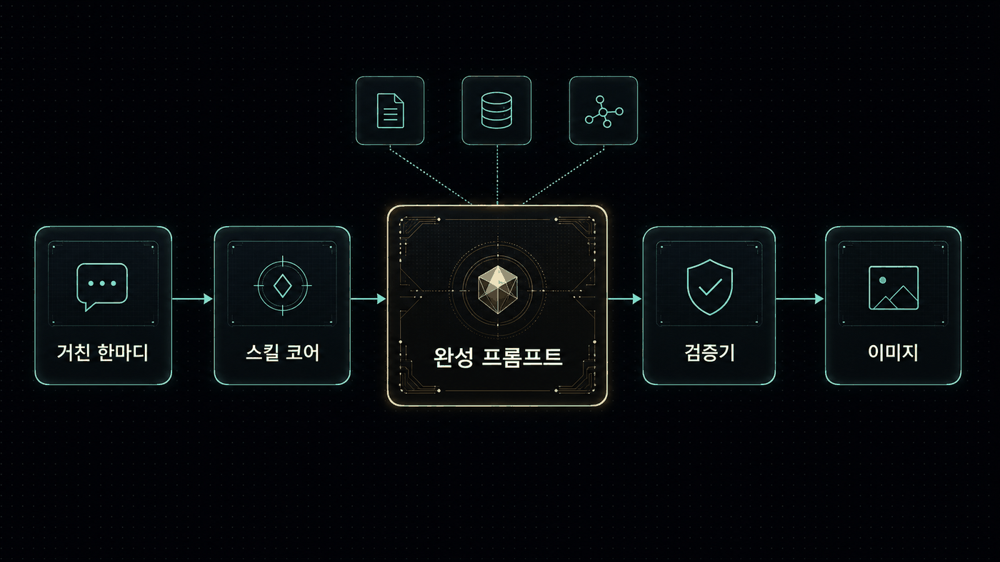

# 🐾 공냥 프롬프트 킷 VOL.2

**막연한 한마디를 gpt-image-2 완성 프롬프트로 컴파일하는 Claude Code 스킬.**


"포스터 하나 만들어줘" 수준의 요청을 받아, 바로 생성에 넣을 수 있는 완성 한국어 프로덕션 프롬프트를 만든다. 1,000장 규모의 라이브러리·화보·포스터·만화를 뽑으며 검증한 규칙을 스킬 하나로 정리했다. 위 키비주얼도 이 킷으로 컴파일한 프롬프트(C11 시네마틱 키아트)로 생성한 것이다.

> 인터랙티브 데모: **[kimsh-1.github.io/gongnyang-prompt-kit](https://kimsh-1.github.io/gongnyang-prompt-kit)**

## 빠른 시작

```bash
git clone https://github.com/kimsh-1/gongnyang-prompt-kit
ln -s "$PWD/gongnyang-prompt-kit/skills/image-prompt" ~/.claude/skills/image-prompt
```

Claude Code에서 "이미지 프롬프트 써줘", "화보 프롬프트", "키아트" 같은 트리거나 `/image-prompt`로 실행한다.

- 심볼릭 링크로 설치하면 레포 업데이트가 자동 반영된다. 복사로 설치했다면 업데이트마다 다시 복사해야 한다.
- 검증기 실행에는 Node.js가 필요하다.

## 무엇을 하나


거친 요청 → 완성 프롬프트 → 검증기 통과. 이 세 단계가 스킬 안에서 끝난다.

| 입력 | 출력 |
|---|---|
| "봄밤 야시장 포스터 하나 만들어줘" | 장면·카메라·조명·팔레트(HEX)·텍스트 배치까지 지정된 완성 프롬프트 + `AR 4:5` |

이미지 생성 자체는 이 스킬의 범위 밖이다. 대량 생성·병렬 스폰은 [codex-fleet](https://github.com/kimsh-1/codex-fleet)의 `codex-imagegen` 스킬을 쓰고, 한 장이면 `codex`에 직접 넣는다. (생성까지 하려면 [Codex CLI](https://github.com/openai/codex) 로그인 + ChatGPT Plus/Pro가 필요하다.)

## 핵심 규칙

잘 나오게 하는 규칙이 아니라, **안 나오게 만드는 습관을 막는** 규칙이다.

| 규칙 | 이유 |
|---|---|
| **네거티브 기본 금지** | gpt-image-2는 "no crowd" 같은 장면 네거티브를 오히려 그 단어로 렌더한다. 장면 배제는 전부 긍정형 — "프레임 안엔 인물 한 명, 단독". |
| **예외는 화이트리스트 2종뿐** | Tier-1 텍스트 렌더 가드(`no duplicate text` 등 7종, 렌더 텍스트가 있을 때만) · Tier-2 화보 컴플라이언스 페어(명시 선언 시만). 나머지 부정문은 전부 검증기가 잡는다. |
| **앞 브래킷 금지** | size는 API 파라미터다. 프롬프트에는 끝에 `AR x:y` 토큰 하나만 둔다. |
| **글자 배치는 영역 문법** | "상단 1/3 타이틀 밴드", 롤 라벨(headline/subhead/callout), 따옴표 카피 고정. 밀집 텍스트는 quality high와 페어링. |
| **장비 스펙 → 결과 서술** | 모델은 `Canon R5 f/1.4`를 모른다. "shallow DoF, background falls off softly"처럼 결과로 쓴다. |
| **SD 품질태그 금지** | `masterpiece, 8k, ultra-detailed`는 노이즈다. |
| **수치를 박는다** | HEX 팔레트, 켈빈, `key:fill 1:2` — 수치가 품질을 올린다. |
| **1행 = 1컷 = 1 호출** | 한 캔버스에 여러 컷을 그리드로 그리지 않는다. (카드뉴스처럼 그리드 자체가 산출물인 경우만 예외.) |

## 두 가지 포맷

| | Format A — 라벨 6섹션 | Format B — 화보 플랫 콤마형 |
|---|---|---|
| **구조** | Scene / Camera / Lighting / Color grading / Texture / Text-in-image | 피사체→얼굴→헤어→장르앵커→장면→의상→구도→조명→팔레트 `#HEX`→질감을 콤마로 잇는 한 문장 |
| **용도** | 포스터·키아트·인포그래픽·도감 등 구조물 전반 | 단독 인물 화보·에디토리얼 전용 |

## 카테고리 C1~C11

패션/화보 · 뷰티 · 한국어 포스터 · 제품 도감 · 캠페인 · 인포그래픽 · 카드뉴스 · 브랜딩 목업 · 3D 아이콘 · 만화/웹툰 · **시네마틱 키아트(VOL.2 신규)**. 컷타입과 기본 AR은 `references/category-patterns.md`에 있다.

## 검증기

작성한 프롬프트가 규칙을 지켰는지 자동으로 검사한다. 티어를 인지해서 화이트리스트 밖 네거티브만 잡는다.

```bash
node skills/image-prompt/scripts/check_prompt.mjs examples/poster.txt      # 텍스트 모드
node skills/image-prompt/scripts/check_prompt.mjs --tier 2 examples/hwabo_formatB.txt
node skills/image-prompt/scripts/check_prompt.mjs --jsonl examples/prompts.sample.jsonl
node skills/image-prompt/scripts/check_prompt.mjs --test                   # 회귀 셀프테스트
```

`{ok, format, tier, errors, warnings}` JSON을 반환한다. 화이트리스트 밖 네거티브·앞 브래킷·SD 폐기어휘·사이즈락 위반·슬롯 토큰 잔존은 `error`(긍정형 rewrite 힌트 포함), 빈 형용사·HEX 누락 등은 `warning`. 통과·실패 샘플은 `examples/`에 있다.

## 구조



거친 요청이 스킬 코어와 레퍼런스를 거쳐 완성 프롬프트가 되고, 검증기를 통과해야 생성으로 넘어간다. (이 구조도 역시 이 킷으로 컴파일한 C6 인포그래픽 프롬프트로 생성했다.)

```
skills/image-prompt/
├─ SKILL.md                      # 코어 — 워크플로우·철칙·티어 네거티브·포맷 A/B·사이즈락·라우팅
├─ references/                   # 필요할 때만 읽는 깊은 내용
│  ├─ category-patterns.md       #   C1~C11 컷타입·기본 AR·만화 A/B 전략·키아트
│  ├─ typography-layout.md       #   영역 문법·롤 라벨·폰트 어휘·정확 문자열·그리드
│  ├─ editorial-hwabo.md         #   화보 Format B·슬롯 12종·컴플라이언스 레인
│  ├─ jsonl-and-examples.md      #   jsonl 스키마·모델 팩트·codex 호출 골격
│  ├─ photo-vocab.md             #   카메라·조명·필름·구도·색 어휘 + 국문/영문 혼용
│  └─ style-taxonomy.md          #   패션 21종 + persona DNA + 마스터 템플릿
└─ scripts/
   ├─ check_prompt.mjs           # 티어 인식 검증기 (--jsonl/--tier/--api/--test)
   └─ fixtures/                  # 회귀 테스트 픽스처
```

SKILL.md에는 항상 로드되는 코어만 두고, 깊은 디테일은 `references/`로 분리했다(progressive disclosure).

## 라이선스

MIT
