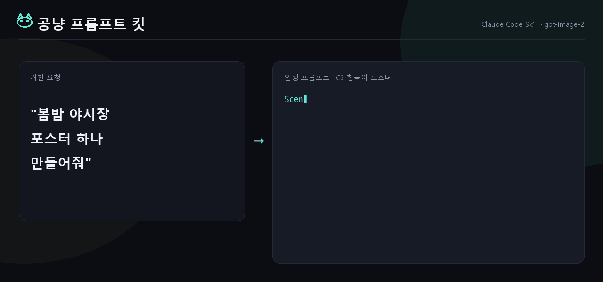

# 🐾 공냥 프롬프트 킷

**막연한 한마디를 gpt-image-2 완성 프롬프트로 컴파일하는 Claude Code 스킬.**



"포스터 하나 만들어줘" 같은 거친 한마디를, 바로 생성에 넣을 수 있는 완성 한국어 프로덕션 프롬프트로 바꾼다. 1,000장 규모 라이브러리·화보·포스터·만화를 뽑으며 다듬은 규칙을 한 스킬로 묶었다.

> 인터랙티브 데모: **[kimsh-1.github.io/gongnyang-prompt-kit](https://kimsh-1.github.io/gongnyang-prompt-kit)**

---

## 핵심 규칙

이미지가 잘 나오게 하는 게 아니라, **안 나오게 하는 습관을 막는** 규칙이다.

- **네거티브 일절 안 씀.** gpt-image-2는 `Negative:`나 `no watermark` 같은 부정문을 오히려 그 단어로 렌더한다. 빼고 싶은 건 전부 긍정형으로 — "워터마크 없음"이 아니라 "브랜드 없는 클린 마감".
- **앞머리 `[AR x:y SIZE]` 브래킷 안 씀.** size는 API 파라미터, 프롬프트엔 끝에 `AR x:y` 토큰만.
- **장비 스펙은 결과로 환원.** 모델은 `Canon R5 f/1.4`를 모른다. "shallow DoF, background falls off softly"로 쓴다.
- **SD 품질태그 버린다.** `masterpiece, 8k, ultra-detailed`는 노이즈.
- **수치는 박는다.** HEX 팔레트, 켈빈, `key:fill 1:2`.
- **1행 = 1컷 = 1 호출.** 한 캔버스에 그리드로 여러 컷 그리지 않는다.

## 구성

```
skills/image-prompt/
├─ SKILL.md                      # 코어 — 워크플로우·철칙·6섹션 템플릿·사이즈락·라우팅 (86줄)
├─ references/                   # 필요할 때만 읽는 깊은 내용
│  ├─ category-patterns.md       #   C1~C10 컷타입·기본 AR·만화 A/B 전략
│  ├─ jsonl-and-examples.md      #   jsonl 스키마·완성 예제·codex 호출 골격
│  ├─ photo-vocab.md             #   카메라·조명·필름·구도·색 어휘 (결과 기반)
│  └─ style-taxonomy.md          #   패션 21종 + persona DNA + 마스터 템플릿
└─ scripts/check_prompt.mjs      # 규칙 위반 자동 검증기 (네거티브·브래킷·SD태그 탐지)
```

SKILL.md는 항상 로드되는 코어만 가볍게, 깊은 디테일은 `references/`로 분리(progressive disclosure)했다.

## 설치

Claude Code 개인 스킬로:

```bash
ln -s "$PWD/skills/image-prompt" ~/.claude/skills/image-prompt
```

이후 "이미지 프롬프트 써줘", "gpt-image-2 프롬프트", "포스터/카드뉴스/만화 프롬프트" 같은 트리거나 `/image-prompt`로 작동한다.

## 검증기

작성한 프롬프트가 규칙을 지켰는지 자동 검사한다.

```bash
node skills/image-prompt/scripts/check_prompt.mjs examples/poster.txt
# 또는
echo "<프롬프트>" | node skills/image-prompt/scripts/check_prompt.mjs
```

`{ok, errors, warnings}` JSON을 반환한다. 네거티브·앞 브래킷·SD 폐기어휘·가중치 문법·끝 AR 누락을 `error`로, 빈 형용사·HEX 누락을 `warning`으로 잡는다. `examples/`에 통과/실패 샘플이 있다.

## 카테고리 (C1~C10)

패션 · 뷰티 · 한국어 포스터 · 제품 도감 · 캠페인 · 인포그래픽 · 카드뉴스 · 브랜딩 목업 · 3D 아이콘 · 만화/웹툰. 각 컷타입·기본 AR은 `references/category-patterns.md`.

## 생성

이 스킬은 **프롬프트를 쓰는 것**까지만 한다. 실제 대량 생성·병렬 스폰은 별도 — [codex-fleet](https://github.com/kimsh-1/codex-fleet)의 `codex-imagegen` 스킬을 쓴다. 단일 1장은 그냥 `codex`에 넣으면 된다.

## 요구사항

- Node.js (검증기 실행용)
- 생성까지 하려면 [Codex CLI](https://github.com/openai/codex) 로그인 + ChatGPT Plus/Pro

## 라이선스

MIT
