# 🐾 공냥 프롬프트 킷 VOL.2

**막연한 한마디를 gpt-image-2 완성 프롬프트로 컴파일하는 Claude Code 스킬.**


"포스터 하나 만들어줘" 수준의 요청을 받아, 바로 생성에 넣을 수 있는 완성 한국어 프로덕션 프롬프트를 만든다. 1,000장 규모의 라이브러리·화보·포스터·만화를 뽑으며 검증한 규칙을 스킬 하나로 정리했다. 위 키비주얼도 이 킷으로 컴파일한 프롬프트(C11 시네마틱 키아트)로 생성한 것이다.

> 인터랙티브 데모: **[kimsh-1.github.io/gongnyang-prompt-kit](https://kimsh-1.github.io/gongnyang-prompt-kit)**

## 빠른 시작

```bash
git clone https://github.com/kimsh-1/gongnyang-prompt-kit
ln -s "$PWD/gongnyang-prompt-kit/skills/image-prompt" ~/.claude/skills/image-prompt
```

Claude Code에서 "이미지 프롬프트 써줘", "화보 프롬프트", "키아트" 같은 트리거나 `/image-prompt`로 실행한다.

- 심볼릭 링크로 설치하면 레포 업데이트가 자동 반영된다. 복사로 설치했다면 업데이트마다 다시 복사해야 한다.
- 검증기 실행에는 Node.js가 필요하다.

## 무엇을 하나


거친 요청 → 완성 프롬프트 → 검증기 통과. 이 세 단계가 스킬 안에서 끝난다.

| 입력 | 출력 |
|---|---|
| "봄밤 야시장 포스터 하나 만들어줘" | 장면·카메라·조명·팔레트(HEX)·텍스트 배치까지 지정된 완성 프롬프트 + `AR 4:5` |

이미지 생성 자체는 이 스킬의 범위 밖이다. 대량 생성·병렬 스폰은 [codex-fleet](https://github.com/kimsh-1/codex-fleet)의 `codex-imagegen` 스킬을 쓰고, 한 장이면 `codex`에 직접 넣는다. (생성까지 하려면 [Codex CLI](https://github.com/openai/codex) 로그인 + ChatGPT Plus/Pro가 필요하다.)

## 생성 예시 — 프롬프트가 이렇게 바뀝니다

같은 gpt-image-2다. **왼쪽은 사람이 친 한 줄을 그대로 넣은 결과, 오른쪽은 그 한 줄을 킷이 컴파일해서 넣은 결과** — 차이는 프롬프트뿐이다. 컴파일 프롬프트 전문은 각 비교의 펼침에서 그대로 복사할 수 있다. 전체 레코드는 [`examples/showcase.jsonl`](examples/showcase.jsonl).

#### `개쩌는 이미지 하나 만들어줘` → C11 시네마틱 키아트

| 스킬 없이 | 킷 컴파일 |
|---|---|
| 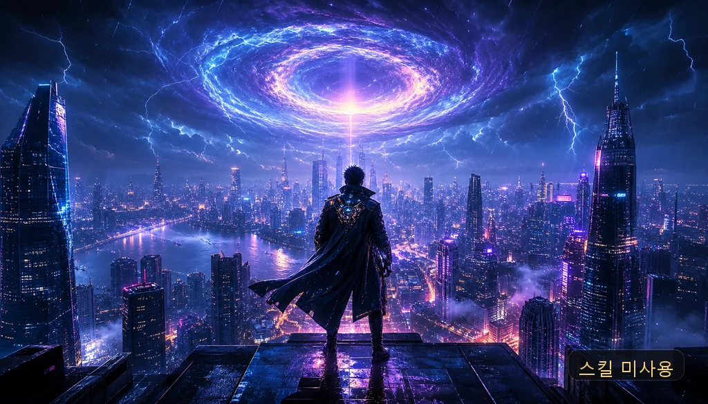 |  |

<details>
<summary>컴파일 프롬프트 전문</summary>

```
시네마틱 키아트 — 새벽 구름바다 위로 도약하는 거대 고래.
Scene: 해 뜨기 직전의 구름 바다, 그 위로 거대한 혹등고래 한 마리가 구름 물보라를 흩뿌리며 도약하는 순간, 아래 절벽 끝에 작은 관측자 실루엣 한 명, 상단 하늘 밴드는 비워둔 클린 영역.
Camera: 초광각 vista, 로우 앵글, 인물 대비 압도적 스케일 대비, deep aerial perspective.
Lighting: 지평선의 골드 백라이트가 고래의 림을 태우고, 구름 틈으로 volumetric 광선이 쏟아진다.
Color grading: 새벽 인디고 #1B2440, 골드 #E8B168, 페일 로즈 #E8C4C4.
Texture/Medium: cinematic grain, 옅은 안개 드리프트.
AR 16:9
```

</details>

#### `화보 한 장` → C1 화보

| 스킬 없이 | 킷 컴파일 |
|---|---|
|  | 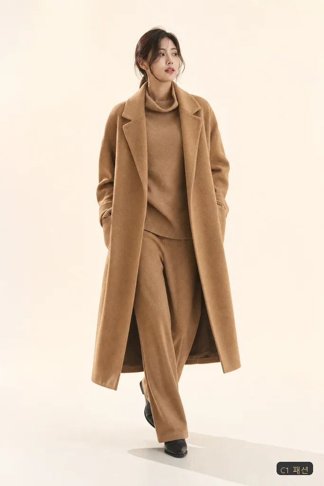 |

<details>
<summary>컴파일 프롬프트 전문</summary>

```
한국 여성 모델의 룩북 전신 컷, 상업 패션 카탈로그 완성도.
Scene: 미색 스튜디오 배경 앞에 선 20대 한국 여성 모델, 오버사이즈 울 코트에 니트 셋업, 자연스러운 워킹 포즈, 프레임 안엔 인물 한 명 단독.
Camera: 전신 세로 구도, 눈높이, shallow DoF, background falls off softly.
Lighting: 큰 소프트박스 정면광과 옅은 림, long soft-edged shadows.
Color grading: 웜 아이보리 #F7F4EC, 카멜 #C19A6B, 잉크 #1C1A17.
Texture/Medium: natural skin texture, visible pores, subtle film grain, 울 원단의 결.
AR 2:3
```

</details>

#### `립밤 광고컷` → C2 뷰티

| 스킬 없이 | 킷 컴파일 |
|---|---|
| 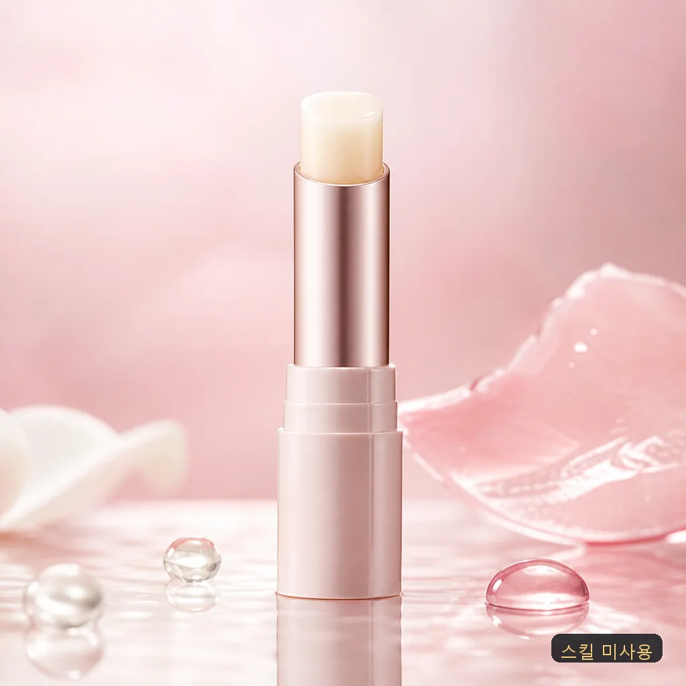 | 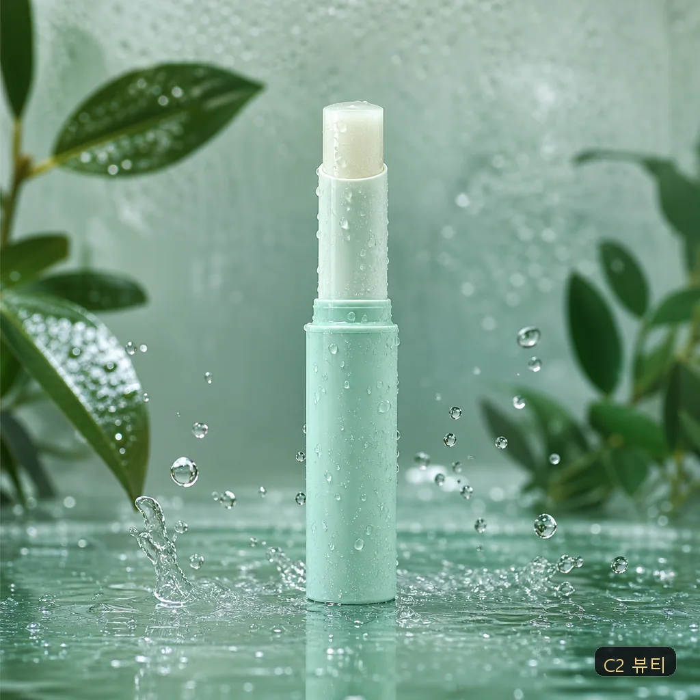 |

<details>
<summary>컴파일 프롬프트 전문</summary>

```
립밤 제품 히어로 매크로, 상업 뷰티 광고 완성도.
Scene: 젖은 유리 표면 위에 세워진 민트색 립밤 스틱 하나, 주위로 튀어오른 물방울과 얇은 물결, 제품 표면에 맺힌 이슬.
Camera: 매크로 근접, 제품 정중앙, 배경은 부드럽게 흐려진다.
Lighting: 클린 스튜디오광, 하이라이트는 하얗게 날아가지 않게, 투명한 젖은 반사.
Color grading: 민트 #BFE8DE, 화이트 #FAFAFA, 딥그린 #1E4D40.
Texture/Medium: 물방울 매크로 물리, 유리 반사, 미세 그레인.
AR 1:1
```

</details>

#### `재즈바 포스터` → C3 한글 포스터

| 스킬 없이 | 킷 컴파일 |
|---|---|
| 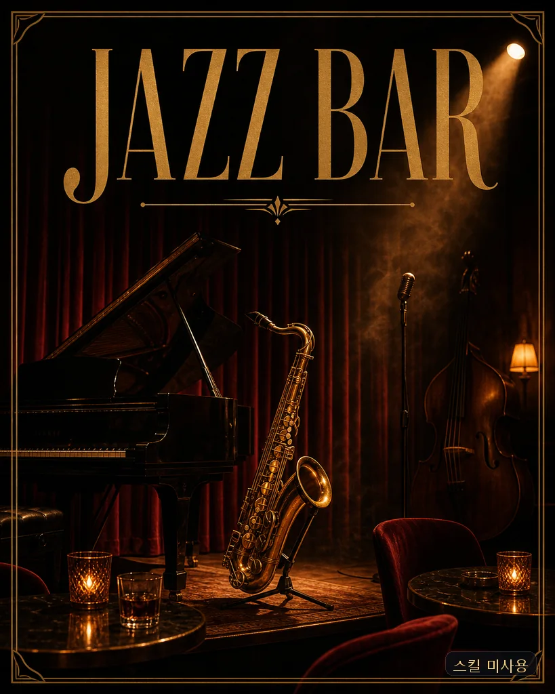 | 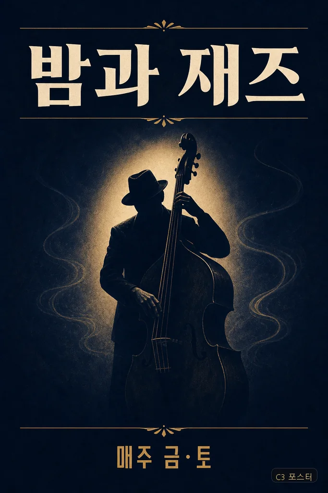 |

<details>
<summary>컴파일 프롬프트 전문</summary>

```
한국어 재즈바 포스터, 상업 인쇄 완성도.
Scene: 상단 1/3 타이틀 밴드, 중앙에 콘트라베이스 연주자의 딥블루 실루엣 일러스트와 담배연기 같은 얇은 곡선, 하단 캡션 밴드. 정돈된 매거진 여백.
Camera: 정면 평면 구성, 중앙 정렬, 풀블리드.
Lighting: 무대 스포트라이트 하나가 실루엣 뒤에서 번지는 글로우.
Color grading: 미드나잇 #101A2E, 크림 #F3EEE2, 브라스 골드 #C9A24B.
Texture/Medium: 매트 아트지, 미세 그레인, 인쇄 톤.
Text-in-image: headline "밤과 재즈" 상단 중앙(굵은 세리프, 크림), caption "매주 금·토" 하단 중앙(콘덴스드 산세리프, 골드).
All text appears once, perfectly legible — no duplicate text, no extra words, no invented glyphs, no watermark.
AR 4:5
```

</details>

#### `이어폰 도감` → C4 제품 도감

| 스킬 없이 | 킷 컴파일 |
|---|---|
| 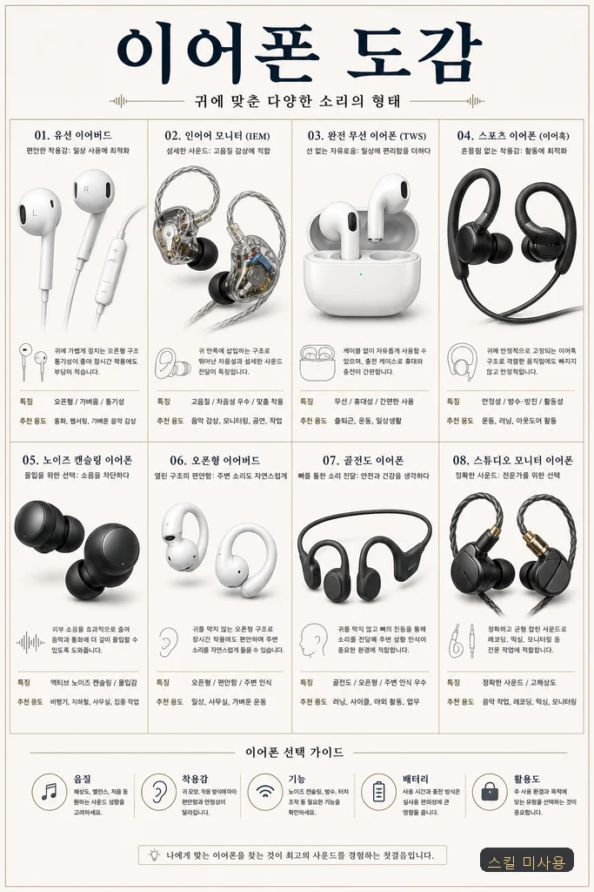 | 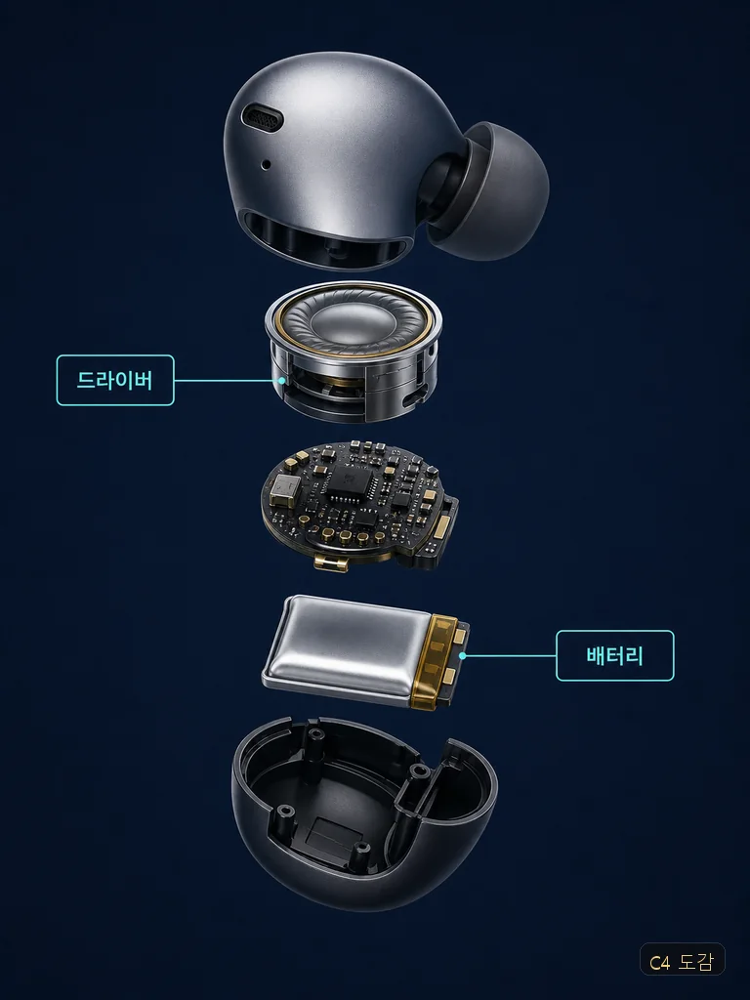 |

<details>
<summary>컴파일 프롬프트 전문</summary>

```
무선 이어폰 분해 도감 컷, 산업 디자인 도록 완성도.
Scene: 딥네이비 무대 중앙에 이어폰 한 쪽이 수직으로 분해되어 떠 있는 exploded view — 하우징, 드라이버 유닛, 기판, 배터리가 층층이 정렬. 각 부품에서 헤어라인 리더선이 뻗어 작은 플로팅 라벨 박스로 이어진다.
Camera: 정면 아이소메트릭 느낌의 평면 구성, 중앙 정렬.
Lighting: 부드러운 톱라이트, 부품 금속면에 절제된 스펙큘러.
Color grading: 딥네이비 #0F1D30, 실버 #C9CDD4, 민트 라인 #5EEAD4.
Texture/Medium: 양극산화 금속·수지 재질 매크로, 클린 벡터 라벨.
Text-in-image: callout "드라이버" 좌중 라벨 박스, callout "배터리" 우중 라벨 박스.
All text appears once, perfectly legible — no duplicate text, no extra words, no invented glyphs, no watermark.
AR 3:4
```

</details>

#### `향수 캠페인` → C5 캠페인

| 스킬 없이 | 킷 컴파일 |
|---|---|
| 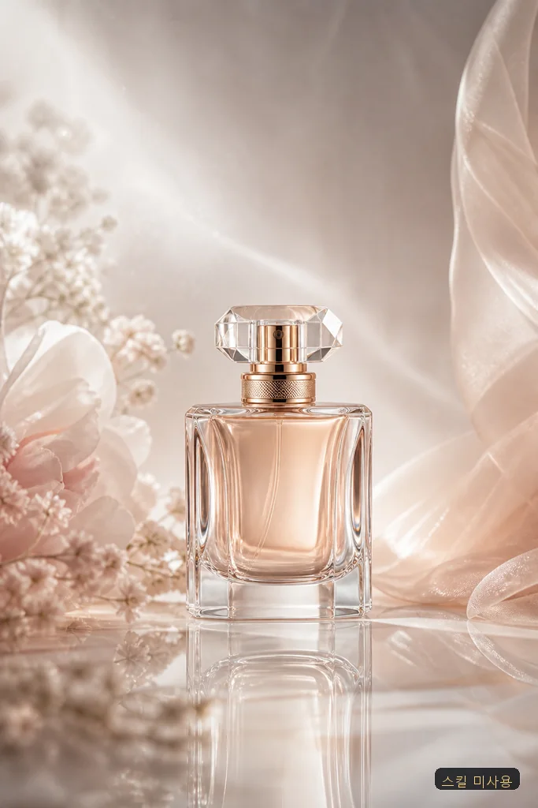 | 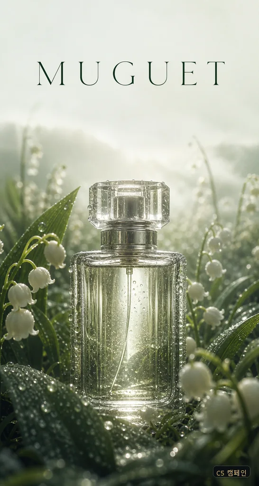 |

<details>
<summary>컴파일 프롬프트 전문</summary>

```
향수 런칭 캠페인 포스터, 하이엔드 코스메틱 광고 완성도.
Scene: 아침 안개 낀 은방울꽃 수풀 사이에 반쯤 잠긴 유리 향수 보틀 하나, 보틀 위로 맺힌 이슬, 상단은 타이틀용 여백.
Camera: 로우앵글 근접, 보틀 중앙, 배경 수풀은 부드럽게 흐려진다.
Lighting: 새벽 백라이트가 보틀 유리를 투과하는 글로우, 옅은 안개 산란.
Color grading: 포그 그린 #DCE8DC, 크리스탈 #F6F8F6, 딥 포레스트 #24402E.
Texture/Medium: 유리 굴절, 이슬 매크로, 미세 필름 그레인.
Text-in-image: headline "MUGUET" 상단 중앙(elegant thin serif, wide letter-spacing, 딥 포레스트).
All text appears once, perfectly legible — no duplicate text, no extra words, no invented glyphs, no watermark.
AR 4:5
```

</details>

#### `커피 인포그래픽` → C6 인포그래픽

| 스킬 없이 | 킷 컴파일 |
|---|---|
| 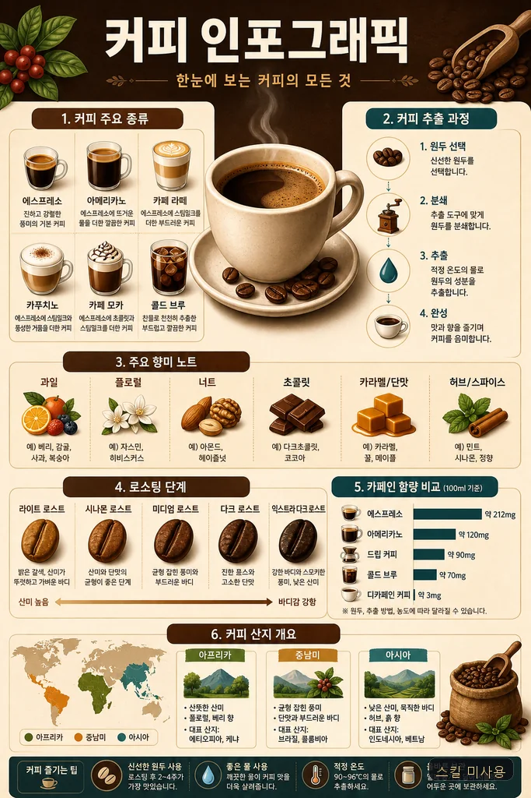 | 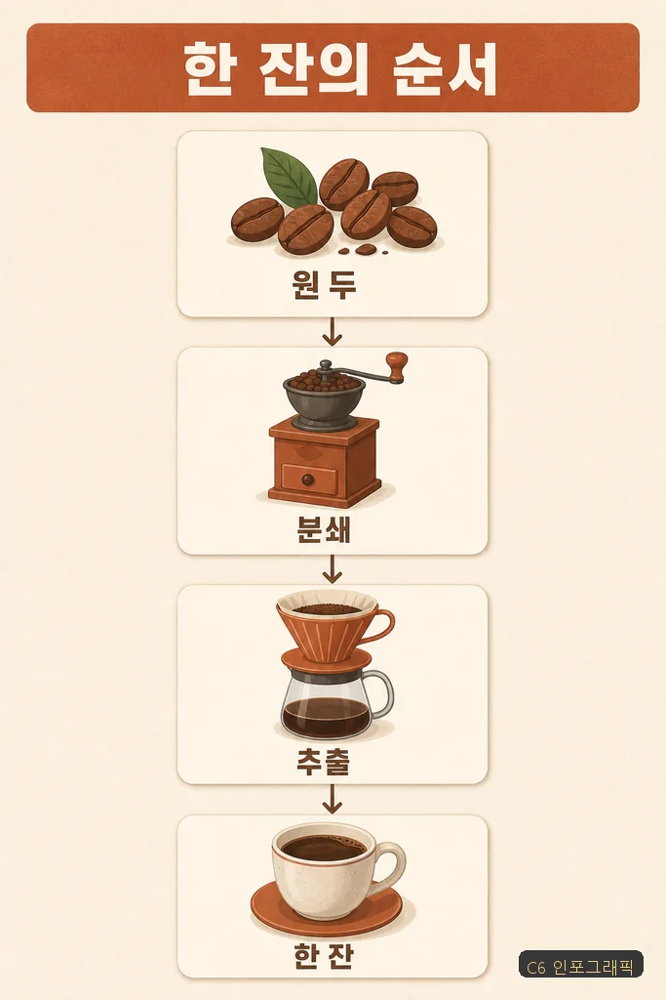 |

<details>
<summary>컴파일 프롬프트 전문</summary>

```
핸드드립 커피 4단계 인포그래픽, 에디토리얼 다이어그램 완성도.
Scene: 크림 캔버스에 세로 플로우 — 라운드 카드 4개가 위에서 아래로 이어지고 카드 사이는 가는 화살표. 각 카드 안에 플랫 일러스트(원두, 그라인더, 드리퍼, 잔). 상단 타이틀 밴드.
Camera: 정면 평면, 중앙 정렬, 풀블리드.
Lighting: 균등광, 옅은 카드 그림자.
Color grading: 크림 #F5EFE6, 로스트 브라운 #6B4A32, 테라코타 #C2714F.
Texture/Medium: 매트 벡터 평면, 종이 질감.
Text-in-image: headline "한 잔의 순서" 상단 밴드 중앙(굵은 산세리프), 카드 라벨 위에서 아래로 "원두", "분쇄", "추출", "한 잔" 각 카드 하단(중간 굵기 산세리프).
All text appears once, perfectly legible — no duplicate text, no extra words, no invented glyphs, no watermark.
AR 2:3
```

</details>

#### `절약 카드뉴스` → C7 카드뉴스

| 스킬 없이 | 킷 컴파일 |
|---|---|
|  | 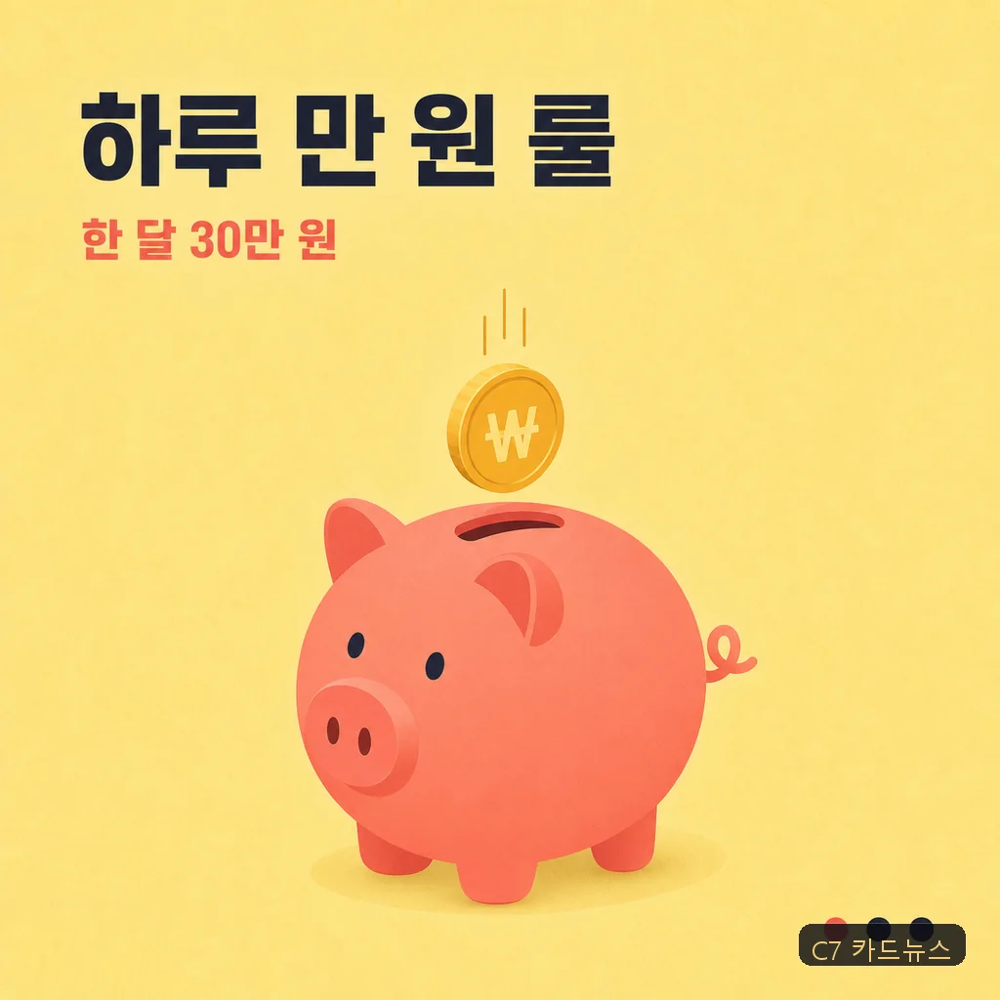 |

<details>
<summary>컴파일 프롬프트 전문</summary>

```
SNS 카드뉴스 커버, 핀테크 에디토리얼 완성도.
Scene: 소프트 옐로 평면 위에 커다란 동전 저금통 플랫 일러스트, 동전 하나가 떨어지는 순간, 좌상단에 타이틀 블록, 우하단에 페이지 인디케이터 점 3개. 읽기 여백이 넉넉한 매거진 레이아웃.
Camera: 정면 평면, 풀블리드.
Lighting: 균등광, 일러스트에 옅은 오프셋 그림자.
Color grading: 소프트 옐로 #FFE9A8, 잉크 #1F2430, 코럴 #F2695C.
Texture/Medium: 매트 벡터 평면, 종이 톤.
Text-in-image: headline "하루 만 원 룰" 좌상단(굵은 산세리프, 잉크), subhead "한 달 30만 원" 그 아래 절반 크기(코럴).
All text appears once, perfectly legible — no duplicate text, no extra words, no invented glyphs, no watermark.
AR 1:1
```

</details>

#### `그래놀라 패키지` → C8 브랜딩

| 스킬 없이 | 킷 컴파일 |
|---|---|
| 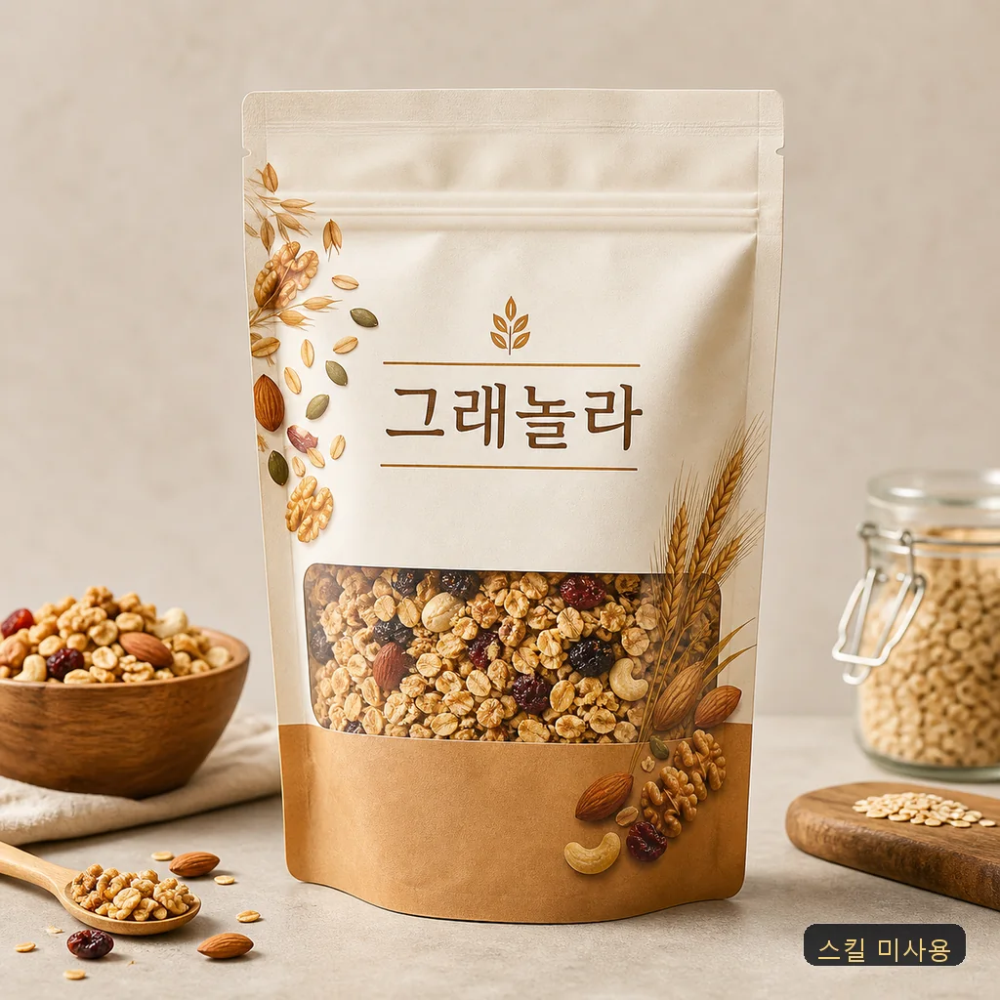 | 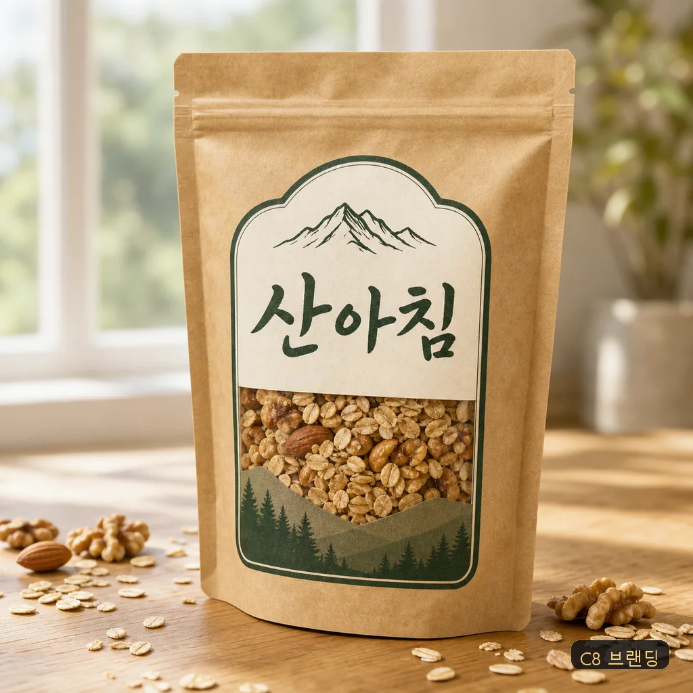 |

<details>
<summary>컴파일 프롬프트 전문</summary>

```
그래놀라 브랜드 패키지 목업, 상업 제품 사진 완성도.
Scene: 밝은 오크 테이블 위 크라프트 파우치 패키지 하나, 주위에 흩어진 귀리와 견과 약간, 뒤로 아침 창가 흐림. 파우치 전면엔 심플한 산 모양 라인 로고와 라벨 영역.
Camera: 정면 45도, 제품 중앙, shallow DoF.
Lighting: 아침 창가 자연광, 부드러운 사이드 섀도.
Color grading: 크라프트 #C8A878, 크림 #F5EFE2, 딥그린 #2E4636.
Texture/Medium: 크라프트지 재질, 무광 인쇄 마감, 곡물 매크로.
Text-in-image: headline "산아침" 파우치 라벨 중앙(붓 느낌 한글 로고타입, 딥그린).
All text appears once, perfectly legible — no duplicate text, no extra words, no invented glyphs, no watermark.
AR 1:1
```

</details>

#### `로켓 3D 아이콘` → C9 3D 아이콘

| 스킬 없이 | 킷 컴파일 |
|---|---|
|  | 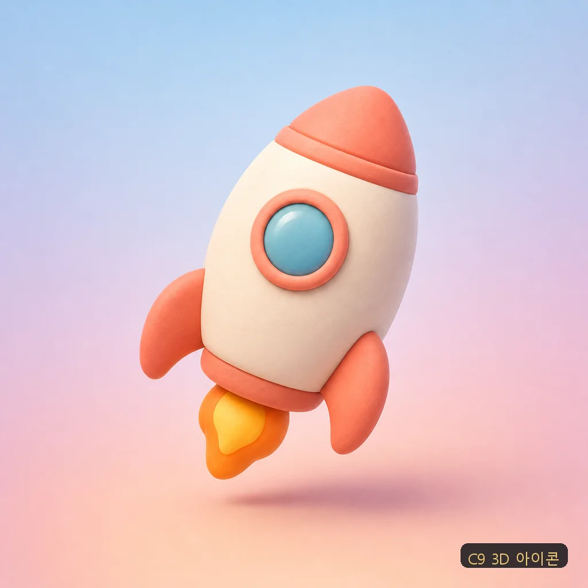 |

<details>
<summary>컴파일 프롬프트 전문</summary>

```
로켓 3D 앱 아이콘, 클레이 렌더 완성도.
Scene: 파스텔 그라데이션 배경 중앙에 통통한 클레이 질감 로켓 하나, 둥근 창과 미니 화염, 살짝 기울어 떠 있는 포즈. 글자 없는 단일 오브젝트 클린 구성.
Camera: 정면 3/4, 오브젝트 중앙.
Lighting: 소프트 스튜디오 3점광, 부드러운 접지 그림자.
Color grading: 파스텔 스카이 #CDE4F5, 코럴 #F58A7A, 크림 #FFF5EA.
Texture/Medium: 매트 클레이 표면, 부드러운 베벨, 미세 SSS 느낌.
AR 1:1
```

</details>

#### `고양이 4컷 만화` → C10 만화

| 스킬 없이 | 킷 컴파일 |
|---|---|
| 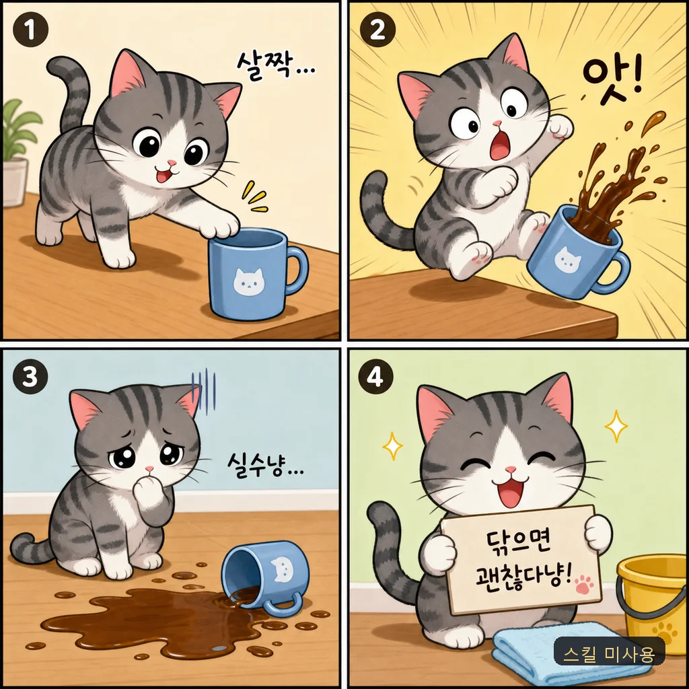 | 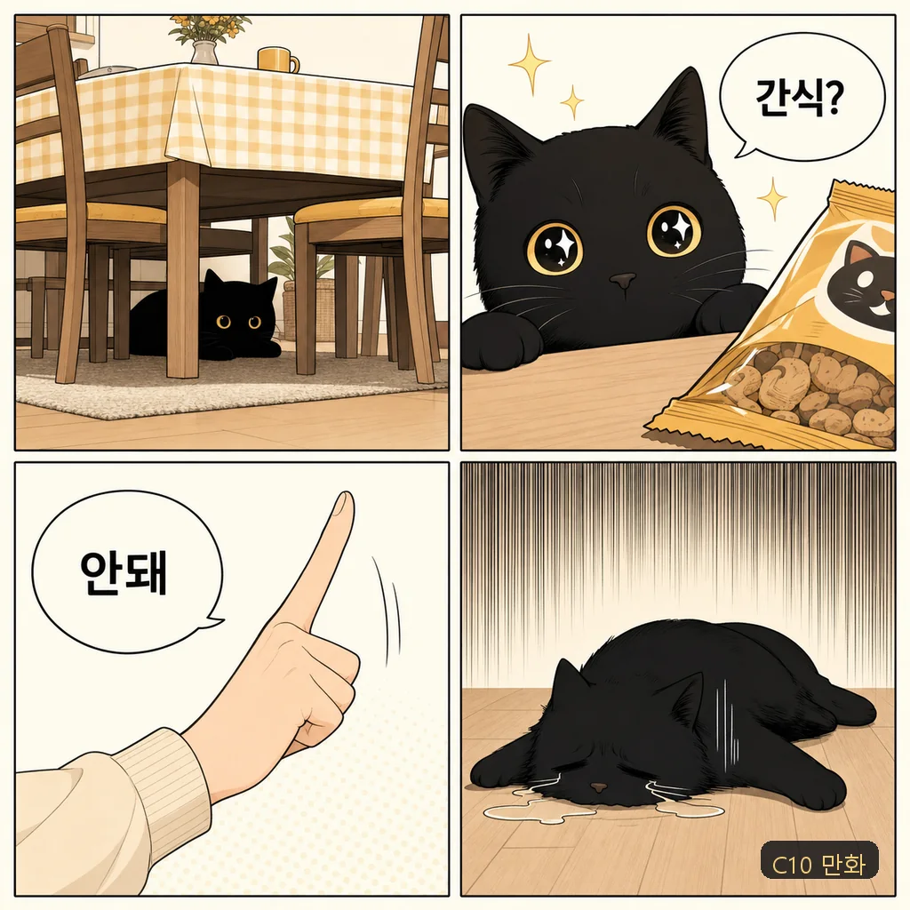 |

<details>
<summary>컴파일 프롬프트 전문</summary>

```
고양이 일상 4컷 만화 한 페이지, 출판 퀄리티.
Scene: 2x2 grid of four panels, equal gutters, 읽기 방향 좌상→우상→좌하→우하. Panel 1: establishing shot, 식탁 밑에서 눈만 내민 검은 고양이. Panel 2: close-up, 간식 봉지를 바라보는 반짝이는 눈, 말풍선 "간식?". Panel 3: 집사의 단호한 손가락, 말풍선 "안돼". Panel 4: reaction shot, 바닥에 녹아내린 고양이, 과장된 절망 이펙트 선.
Camera: 컷마다 앵글 변화, 클린 칸 구성.
Lighting: 플랫 셀 셰이딩, 옅은 스크린톤 그림자.
Color grading: 웜 화이트 #FFF8EE, 잉크 #26221E, 머스터드 #E8B54D.
Texture/Medium: 깔끔한 잉킹 선화, soft cel shading, 스크린톤.
All text appears once, perfectly legible — no duplicate text, no extra words, no invented glyphs, no watermark.
AR 1:1
```

</details>

#### `SF 키아트` → C11 키아트

| 스킬 없이 | 킷 컴파일 |
|---|---|
|  | 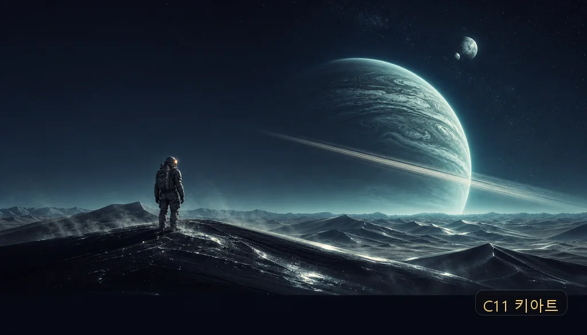 |

<details>
<summary>컴파일 프롬프트 전문</summary>

```
Cinematic science-fiction key art.
Scene: a lone explorer in a weathered vac-suit stands on a ridge of black glass dunes, facing a colossal ringed gas giant rising over the horizon; twin moons hang in the upper sky band left empty for a future title; the bottom eighth stays a clean dark band.
Camera: ultra-wide vista, tiny human figure against vast scale, deep aerial perspective.
Lighting: cold planet-light rim on the dunes, warm suit visor glow as the only warm note, long soft shadows.
Color grading: void indigo #101528, glacial teal #6FB5AE, ember amber #D98A4B.
Texture/Medium: cinematic grain, faint dust haze drifting across the ridge.
AR 16:9
```

</details>

#### `럭셔리 시계` → L1 럭셔리 에디토리얼

| 스킬 없이 | 킷 컴파일 |
|---|---|
| 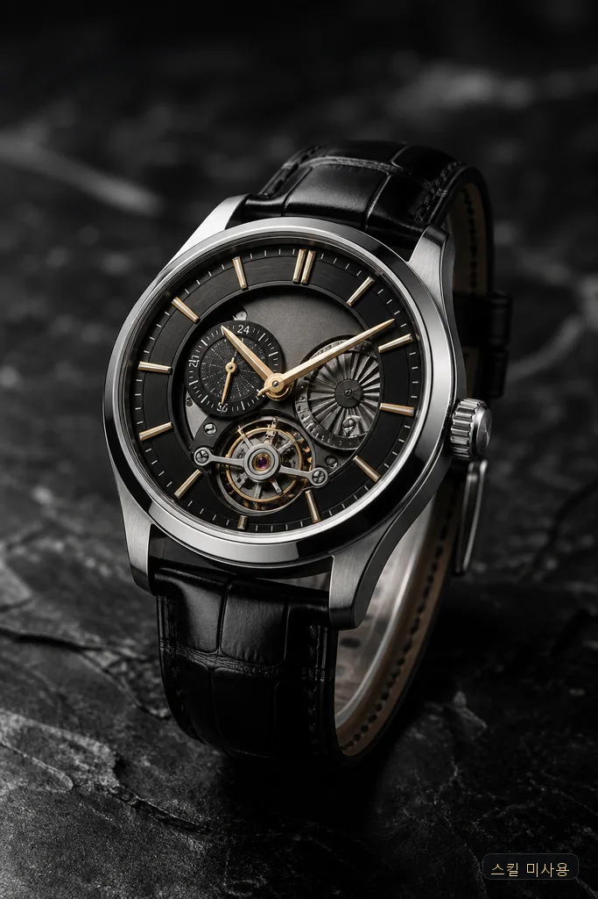 | 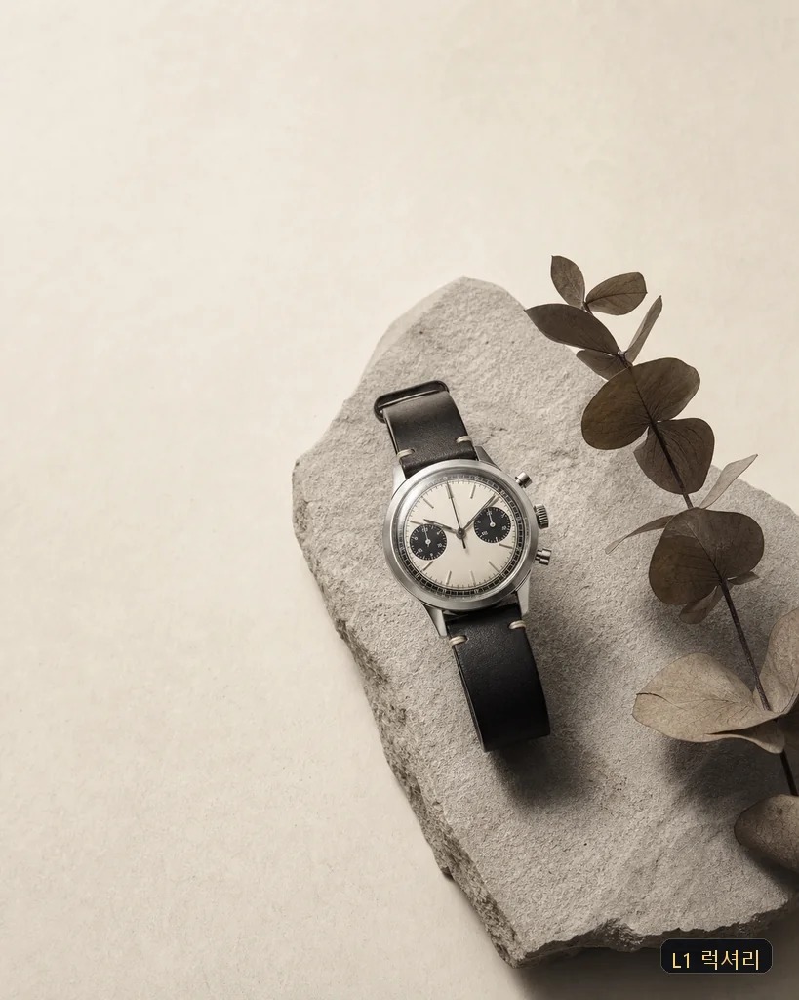 |

<details>
<summary>컴파일 프롬프트 전문</summary>

```
수동 크로노그래프 손목시계 에디토리얼 컷, 하이엔드 매거진 완성도.
Scene: 회색 석회암 판 위에 놓인 시계 하나, generous negative space dominating the frame, subject occupying under one third, 곁에 마른 유칼립투스 가지 하나.
Camera: 탑다운에서 살짝 기운 앵글, shallow DoF.
Lighting: soft directional daylight with long gentle shadows, 케이스 금속에 절제된 하이라이트.
Color grading: muted ivory field #F5F1E8, ink #1C1A17, taupe accent #8C7B6B.
Texture/Medium: matte uncoated paper grain, 석재 결, 사파이어 글라스 반사.
AR 4:5
```

</details>

#### `미니멀 텀블러` → L3 미니멀 프로덕트

| 스킬 없이 | 킷 컴파일 |
|---|---|
| 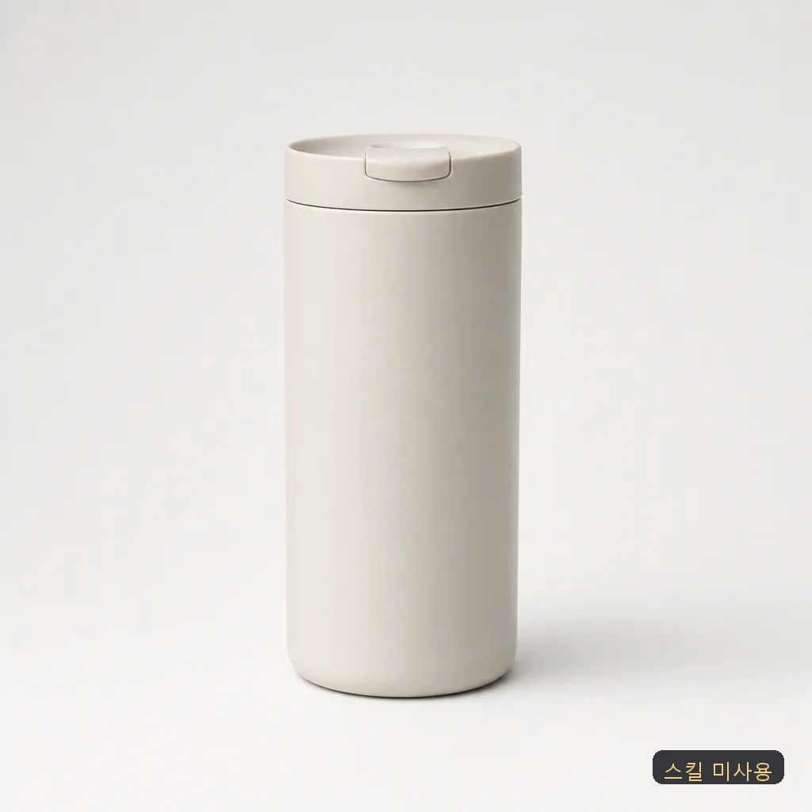 | 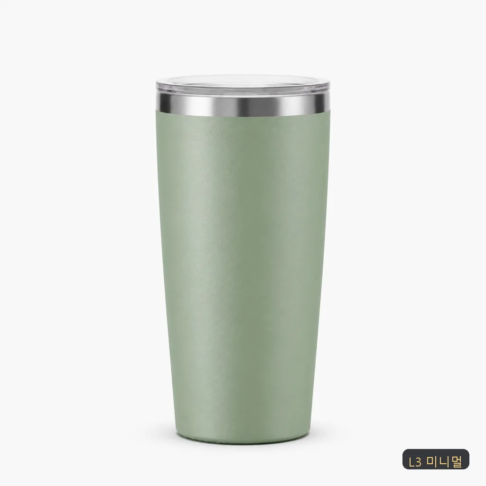 |

<details>
<summary>컴파일 프롬프트 전문</summary>

```
스테인리스 텀블러 제품 히어로.
Scene: product hero on a seamless white stage #FAFAFA, perfectly clean single-subject composition, 세이지 그린 무광 텀블러 하나가 정중앙에 수직으로.
Camera: 정면 눈높이, 제품이 프레임 하단 2/3를 차지.
Lighting: soft top-light with one crisp contact shadow anchoring the object, polished surface reflections kept subtle.
Color grading: 화이트 #FAFAFA, 세이지 #9DB4A0, 잉크 #111111.
Texture/Medium: true-to-material 무광 파우더코팅 질감, 매끈한 금속 림.
AR 1:1
```

</details>

#### `대시보드 히어로` → L5 다크 테크

| 스킬 없이 | 킷 컴파일 |
|---|---|
|  | 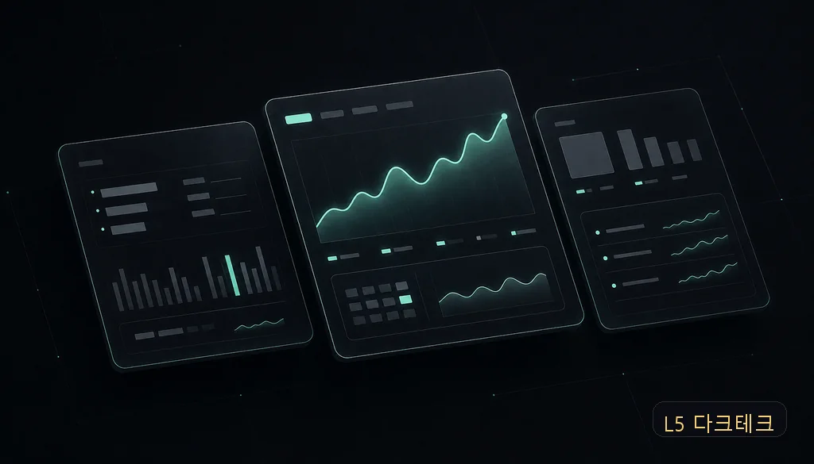 |

<details>
<summary>컴파일 프롬프트 전문</summary>

```
SaaS 대시보드 히어로 그래픽.
Scene: near-black canvas #0B0D12, hairline borders instead of shadows, 중앙에 살짝 기울어 떠 있는 대시보드 UI 카드 3장 — 추상 막대·블록·스파크라인 도형으로만 구성, one restrained mint glow accent #5EEAD4 이 메인 차트 라인을 따라 흐른다. dark technical premium mood, crisp UI-card surfaces floating with subtle depth.
Camera: 정면에서 살짝 부감, 카드 중앙 정렬.
Lighting: 민트 글로우 발광과 카드 에지의 헤어라인 하이라이트.
Color grading: 니어블랙 #0B0D12, 민트 #5EEAD4, 딤 그레이 #8B93A7.
Texture/Medium: 매트 다크 평면, 유리 느낌 카드 표면, 미세 그레인.
AR 16:9
```

</details>

#### `연말 초대장` → L8 골드 포일

| 스킬 없이 | 킷 컴파일 |
|---|---|
|  | 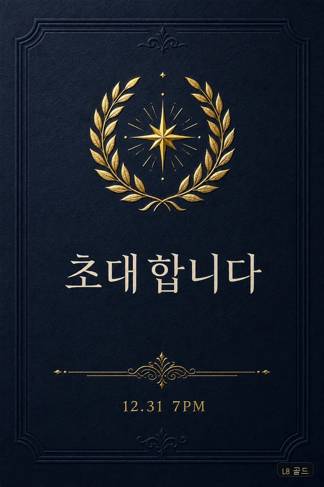 |

<details>
<summary>컴파일 프롬프트 전문</summary>

```
연말 갈라 초대장, 레터프레스 인쇄 완성도.
Scene: deep navy field #101A2E, embossed gold-foil motifs #C9A24B catching a soft raking light — 중앙 상단에 월계수 리스와 별 모티프, 중앙에 타이틀 영역, 하단에 가는 골드 라인 오너먼트, letterpress paper texture with debossed line ornaments.
Camera: 정면 탑다운 평면, 중앙 대칭.
Lighting: 사선 raking light가 금박 엠보스를 따라 반짝임.
Color grading: 딥 네이비 #101A2E, 골드 포일 #C9A24B, 크림 #F3EEE2.
Texture/Medium: 코튼지 레터프레스 눌림, 금박 스펙큘러, ceremonial premium finish.
Text-in-image: headline "초대합니다" 중앙(elegant thin serif 느낌의 한글 명조, 크림), caption "12.31 7PM" 하단 중앙 소형(골드).
All text appears once, perfectly legible — no duplicate text, no extra words, no invented glyphs, no watermark.
AR 2:3
```

</details>

#### `파도 타이포그래피 포스터` → T1 움직임 번역

| 스킬 없이 | 킷 컴파일 |
|---|---|
| 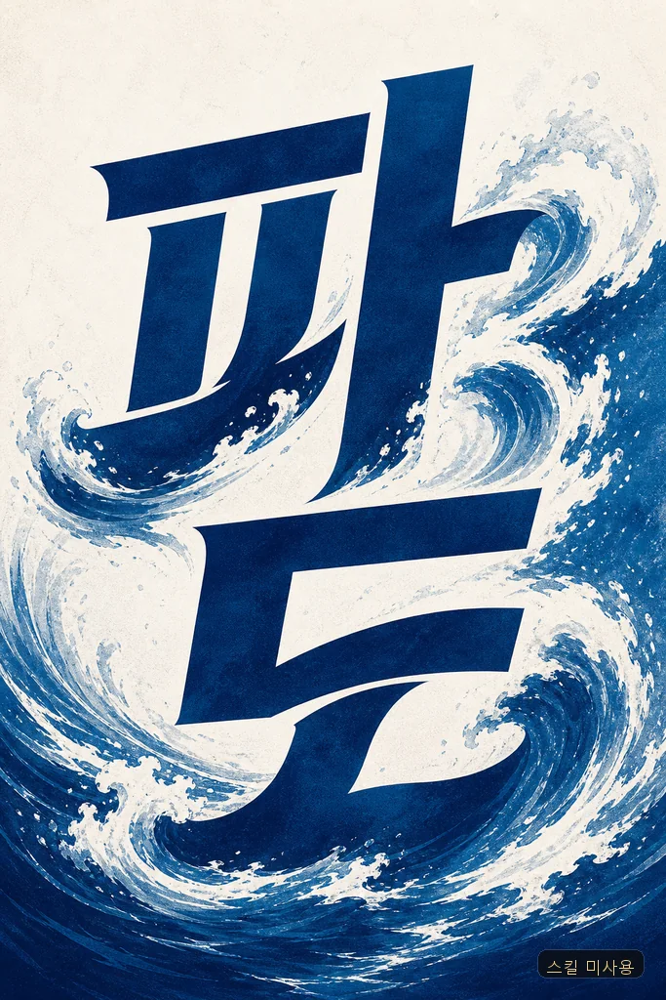 | 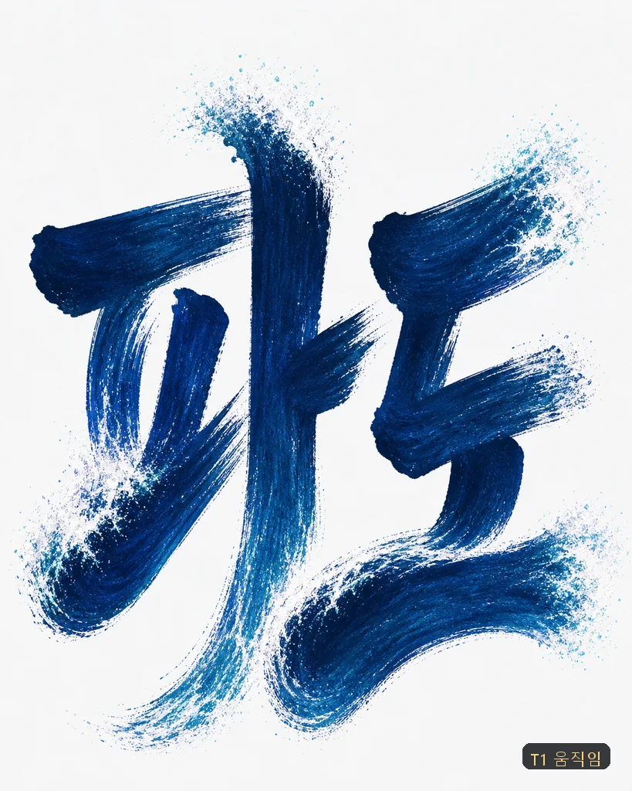 |

<details>
<summary>컴파일 프롬프트 전문</summary>

```
타이포그래피 아트 포스터 — 파도의 에너지를 실은 한글 레터링이 유일한 피사체.
Scene: 옅은 포말빛 필드 전면을 거대한 한글 레터링 '파도'가 채우는 구성. letterforms carrying the surge of a breaking wave: thick brush strokes swelling and curling upward with momentum, stroke tips bursting into fine white spray droplets, the baseline rolling like a swell, deep-sea ink gradating to foam white inside each stroke — the lettering is the only subject in the frame, all of the wave's energy living inside the strokes.
Camera: 정면 평면 포스터 구성, 레터링이 프레임의 80%를 차지하는 과감한 스케일.
Lighting: 균일한 인쇄 광, 획 안쪽에만 깊이감 있는 톤 변화.
Color grading: deep sea ink #1D4E89, midnight undertone #101A2E, foam white #F5F8FA, 시안 스프레이 포인트 #5EEAD4.
Texture/Medium: 두꺼운 스크린프린트 잉크 질감, 획 가장자리의 미세한 물보라 입자.
Text-in-image: headline "파도" 화면 중앙(초대형 브러시 한글 레터링, 딥블루).
All text appears once, perfectly legible — no duplicate text, no extra words, no invented glyphs, no watermark.
AR 4:5
```

</details>

#### `야시장 타이포그래피 포스터, 힙하고 키치하게` → T3 의도 왜곡

| 스킬 없이 | 킷 컴파일 |
|---|---|
| 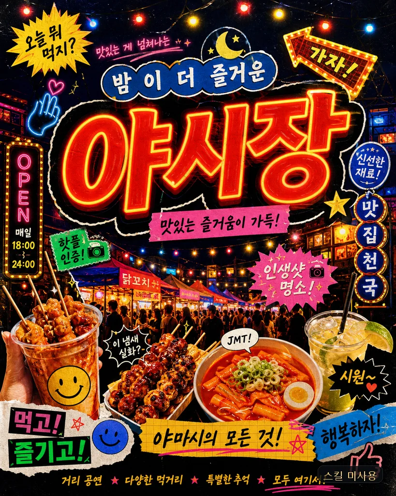 | 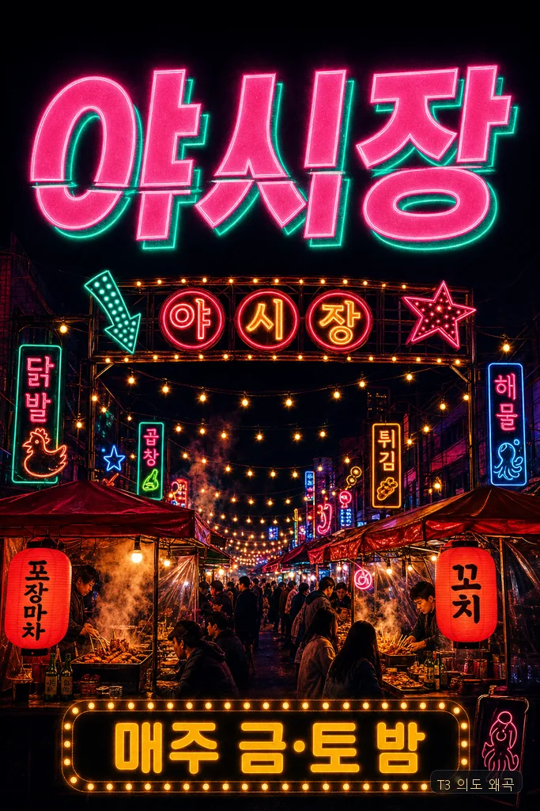 |

<details>
<summary>컴파일 프롬프트 전문</summary>

```
키치 네온 타이포그래피 포스터 — 의도적으로 왜곡된 한글 레터링이 주인공.
Scene: 순흑에 가까운 밤 필드 중앙에 대형 한글 레터링 '야시장' — deliberately distorted lettering: each glyph sliced horizontally at its waist, the upper half shifted sideways like a mis-registered screen print, strokes stretched tall and slightly wobbling as if seen through hot night air, distortion stopping just before legibility breaks. 글자 주변에 네온 사인의 옅은 글로우와 작은 전구 점들이 흩어진 야시장 무드.
Camera: 정면 평면 포스터 구성, 레터링이 프레임 70%를 차지.
Lighting: 네온 글로우가 글자 획에서 배어나오는 self-lit lettering, 배경은 딥 섀도.
Color grading: hot pink neon #F25C9B, electric mint offset layer #5EEAD4, warm bulb amber #F2B705, near-black night field #0B0D12.
Texture/Medium: 네온 튜브의 유리 광택과 미세한 헤이즈, 스크린프린트 오프셋의 어긋난 잉크 레이어.
Text-in-image: headline "야시장" 중앙(초대형 절단·오프셋 한글 레터링, 핑크+민트 이중 레이어).
All text appears once, perfectly legible — no duplicate text, no extra words, no invented glyphs, no watermark.
AR 4:5
```

</details>

#### `위스키 광고 포스터 고급스럽게` → M2 아르데코

| 스킬 없이 | 킷 컴파일 |
|---|---|
|  |  |

<details>
<summary>컴파일 프롬프트 전문</summary>

```
위스키 브랜드 포스터 — 아르데코 재해석, 하이엔드 주류 광고 완성도.
Scene: 딥네이비 새틴 필드 중앙에 각진 크리스탈 디캔터 단 하나, 그 뒤로 하단에서 솟아오르는 방사형 선셋버스트 골드 라인, 화면 가장자리는 가는 계단형 코너 오나먼트만 절제된 대칭으로. 상단 타이틀 밴드는 넉넉한 여백. Art Deco geometry — radiating sunburst lines, stepped corner ornaments, vertical emphasis, gilded linework over deep navy, polished lacquer finish.
Camera: 정면 대칭 포스터 구성, 디캔터가 프레임 하단 2/3 중앙, 풀블리드.
Lighting: 앰버 백글로우가 디캔터를 투과해 액체가 스스로 빛나는 느낌, 금박 라인엔 raking light.
Color grading: deep navy #101A2E, gold #C9A24B, cream #F3EEE2, amber liquid #B36A2E.
Texture/Medium: 래커 마감 인쇄 톤, 금박의 미세한 반짝임, 파인 그레인.
Text-in-image: headline "밤의 황금기" 상단 밴드 중앙(아르데코 기하 세리프, 골드, 넓은 자간).
All text appears once, perfectly legible — no duplicate text, no extra words, no invented glyphs, no watermark.
AR 4:5
```

</details>

#### `록 페스티벌 포스터 멋지게` → M8 구성주의

| 스킬 없이 | 킷 컴파일 |
|---|---|
| 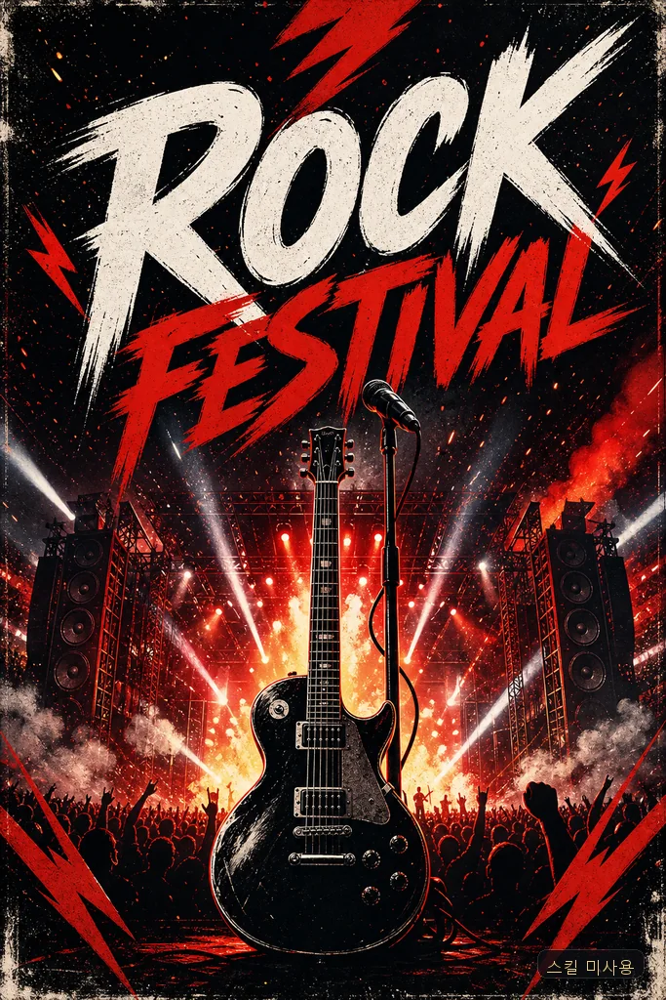 | 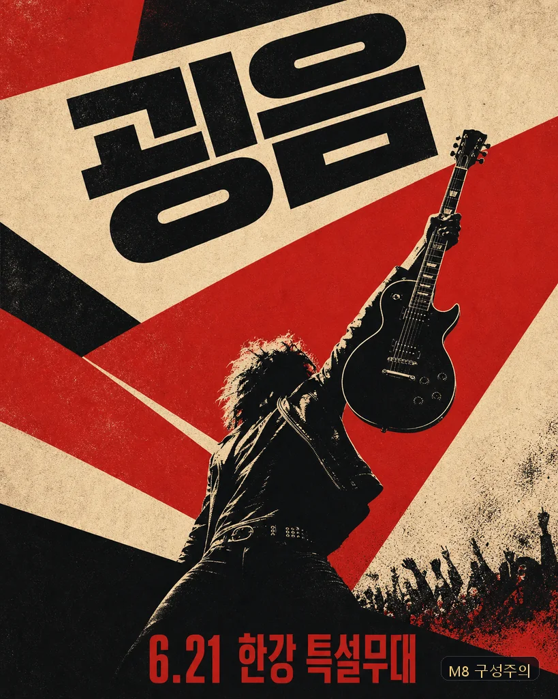 |

<details>
<summary>컴파일 프롬프트 전문</summary>

```
록 페스티벌 포스터 — 구성주의 재해석, 공연 인쇄물 완성도.
Scene: 사선으로 화면을 가로지르는 적·흑 컬러 플레인, 그 교차점에 일렉 기타를 치켜든 연주자의 하이컨트라스트 포토몽타주 실루엣, 상단 대각 타이틀 밴드. constructivist poster dynamics — aggressive diagonal composition, angular planes slicing across the field, photomontage-style subject placement, kinetic propaganda energy.
Camera: 정면 평면 포스터 구성, 대각 정렬, 풀블리드.
Lighting: 플랫 인쇄 광, 실루엣 가장자리는 하드 컷.
Color grading: vermilion red #B33A2B, ink black #111111, aged cream #E8DCC4.
Texture/Medium: 거친 오프셋 인쇄 질감, 스텐실 에지, 종이 결.
Text-in-image: headline "굉음" 상단 대각 밴드(초굵은 그로테스크 산세리프, 블랙), caption "6.21 한강 특설무대" 하단(콘덴스드 산세리프, 레드).
All text appears once, perfectly legible — no duplicate text, no extra words, no invented glyphs, no watermark.
AR 4:5
```

</details>

#### `향초 브랜드 포스터 예쁘게` → M7 아르누보

| 스킬 없이 | 킷 컴파일 |
|---|---|
|  | 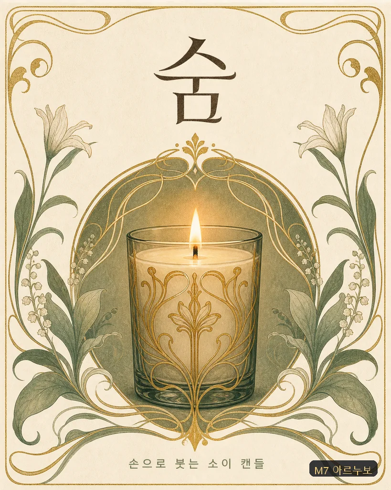 |

<details>
<summary>컴파일 프롬프트 전문</summary>

```
핸드메이드 향초 브랜드 포스터 — 아르누보 재해석, 부티크 인쇄물 완성도.
Scene: 아이보리 필드 중앙에 유리컵 소이 캔들 하나, 촛불 주위를 식물 줄기 곡선과 금박 라인 장식 프레임이 유기적으로 감싸는 구성, 상단 타이틀 여백. Art Nouveau linework — flowing botanical curves framing the subject, hand-drawn organic ornament, lithograph texture.
Camera: 정면 대칭 포스터 구성, 캔들 중앙, 풀블리드.
Lighting: 촛불의 웜 글로우가 프레임 안쪽을 은은히 밝히는 부드러운 명암.
Color grading: sage #7A8C5F, ivory #F3EEE2, gilded gold #C9A24B, deep brown #4A3B2A.
Texture/Medium: 리소그래프 인쇄 질감, 손그림 라인의 미세한 흔들림, 무광 종이.
Text-in-image: headline "숨" 상단 중앙(아르누보 곡선 세리프, 딥브라운), caption "손으로 붓는 소이 캔들" 하단 중앙(가는 산세리프, 세이지).
All text appears once, perfectly legible — no duplicate text, no extra words, no invented glyphs, no watermark.
AR 4:5
```

</details>

#### `일렉트로닉 파티 포스터 힙하게` → M9 사이키델릭

| 스킬 없이 | 킷 컴파일 |
|---|---|
| 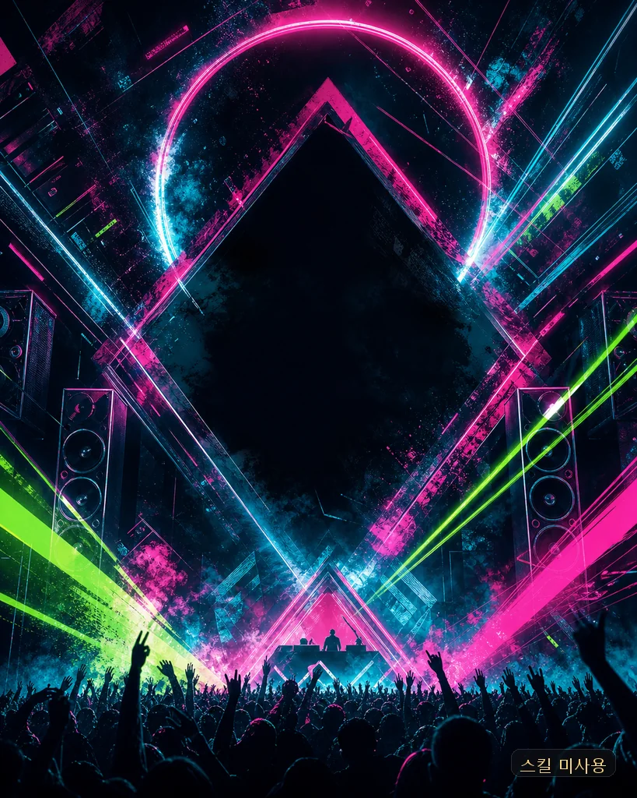 | 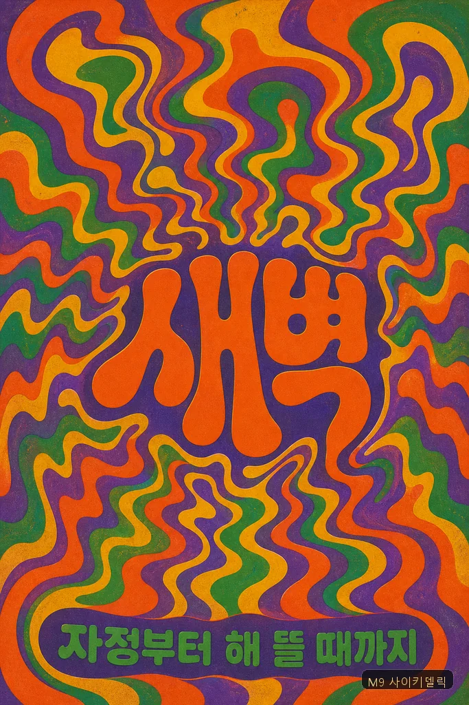 |

<details>
<summary>컴파일 프롬프트 전문</summary>

```
일렉트로닉 파티 포스터 — 70년대 사이키델릭 재해석, 공연 인쇄물 완성도.
Scene: 소용돌이치는 동심원 물결이 화면 전체를 채우고, 그 리듬을 그대로 타고 흐르는 한글 레터링이 중앙에서 바깥으로 퍼지는 유동 구성. 70s psychedelic flow — melting liquid shapes and swirling rhythm, wavy concentric contours, vintage offset print grain.
Camera: 정면 평면 포스터, 중앙 방사 구성, 풀블리드.
Lighting: 플랫 인쇄 광, 고채도 색면 대비로 깊이를 만든다.
Color grading: saturated clash of orange #E85D1F, purple #7B4EA3, green #3E8C4F, yellow #F2B705.
Texture/Medium: 빈티지 오프셋 그레인, 살짝 어긋난 잉크 미스레지스트레이션.
Text-in-image: headline "새벽" 중앙(물결치는 사이키델릭 한글 레터링, 오렌지), caption "자정부터 해 뜰 때까지" 하단(라운드 산세리프, 그린).
All text appears once, perfectly legible — no duplicate text, no extra words, no invented glyphs, no watermark.
AR 4:5
```

</details>

## 핵심 규칙

잘 나오게 하는 규칙이 아니라, **안 나오게 만드는 습관을 막는** 규칙이다.

| 규칙 | 이유 |
|---|---|
| **네거티브 기본 금지** | gpt-image-2는 "no crowd" 같은 장면 네거티브를 오히려 그 단어로 렌더한다. 장면 배제는 전부 긍정형 — "프레임 안엔 인물 한 명, 단독". |
| **예외는 화이트리스트 2종뿐** | Tier-1 텍스트 렌더 가드(`no duplicate text` 등 7종, 렌더 텍스트가 있을 때만) · Tier-2 화보 컴플라이언스 페어(명시 선언 시만). 나머지 부정문은 전부 검증기가 잡는다. |
| **앞 브래킷 금지** | size는 API 파라미터다. 프롬프트에는 끝에 `AR x:y` 토큰 하나만 둔다. |
| **글자 배치는 영역 문법** | "상단 1/3 타이틀 밴드", 롤 라벨(headline/subhead/callout), 따옴표 카피 고정. 밀집 텍스트는 quality high와 페어링. |
| **장비 스펙 → 결과 서술** | 모델은 `Canon R5 f/1.4`를 모른다. "shallow DoF, background falls off softly"처럼 결과로 쓴다. |
| **SD 품질태그·죽은 단어 금지** | `masterpiece, 8k`도, "예쁘게·고급스럽게·어워드 수준으로"도 노이즈다. 기준이 프롬프트 밖에 있으면 평균값만 나온다 — 수치·몸 반응·구체 예시로 환원한다. |
| **수치를 박는다** | HEX 팔레트, 켈빈, `key:fill 1:2` — 수치가 품질을 올린다. |
| **1행 = 1컷 = 1 호출** | 한 캔버스에 여러 컷을 그리드로 그리지 않는다. (카드뉴스처럼 그리드 자체가 산출물인 경우만 예외.) |

## 두 가지 포맷

| | Format A — 라벨 6섹션 | Format B — 화보 플랫 콤마형 |
|---|---|---|
| **구조** | Scene / Camera / Lighting / Color grading / Texture / Text-in-image | 피사체→얼굴→헤어→장르앵커→장면→의상→구도→조명→팔레트 `#HEX`→질감을 콤마로 잇는 한 문장 |
| **용도** | 포스터·키아트·인포그래픽·도감 등 구조물 전반 | 단독 인물 화보·에디토리얼 전용 |

## 카테고리 C1~C12

패션/화보 · 뷰티 · 한국어 포스터 · 제품 도감 · 캠페인 · 인포그래픽 · 카드뉴스 · 브랜딩 목업 · 3D 아이콘 · 만화/웹툰 · 시네마틱 키아트 · **프레젠테이션 덱(신규)**. 컷타입과 기본 AR은 `references/category-patterns.md`에 있다.

"있어보이게"는 감으로 조립하지 않는다 — `references/look-presets.md`의 **룩 프리셋 8종**(럭셔리 에디토리얼·시네마틱 그레이드·미니멀 프로덕트·스위스 타이포·다크 테크·레트로 인쇄·파스텔·골드 포일)에서 골라 드롭인한다.

시안을 여러 개 벌리거나 컨셉부터 잡을 땐 `references/concept-axes.md`의 **변수 축**을 쓴다 — 미학 사조 10종(바우하우스~와비사비, 조형언어 분해 드롭인), 몸 반응 번역("고급스럽게" 대신 "목소리를 낮추고 조용히 보게 되는"), 모순쌍 레이어 분리, 음악·장면→컬러 번역, 타이포 아트 4기법(위 [스킬 전후](#스킬-전후--같은-요청-같은-모델) 비교가 T1·T3 실물이다). 같은 피사체를 축 하나로 스윕하면 양산 컨셉 시안이 나온다.

## 검증기

작성한 프롬프트가 규칙을 지켰는지 자동으로 검사한다. 티어를 인지해서 화이트리스트 밖 네거티브만 잡는다.

```bash
node skills/image-prompt/scripts/check_prompt.mjs examples/poster.txt      # 텍스트 모드
node skills/image-prompt/scripts/check_prompt.mjs --tier 2 examples/hwabo_formatB.txt
node skills/image-prompt/scripts/check_prompt.mjs --jsonl examples/prompts.sample.jsonl
node skills/image-prompt/scripts/check_prompt.mjs --test                   # 회귀 셀프테스트
```

`{ok, format, tier, errors, warnings}` JSON을 반환한다. 화이트리스트 밖 네거티브·앞 브래킷·SD 폐기어휘·사이즈락 위반·슬롯 토큰 잔존은 `error`(긍정형 rewrite 힌트 포함), 빈 형용사·HEX 누락 등은 `warning`. 통과·실패 샘플은 `examples/`에 있다.

## 구조


거친 요청이 스킬 코어와 레퍼런스를 거쳐 완성 프롬프트가 되고, 검증기를 통과해야 생성으로 넘어간다. (이 구조도 역시 이 킷으로 컴파일한 C6 인포그래픽 프롬프트로 생성했다.)

```
skills/image-prompt/
├─ SKILL.md                      # 코어 — 워크플로우·철칙·티어 네거티브·포맷 A/B·사이즈락·라우팅
├─ references/                   # 필요할 때만 읽는 깊은 내용
│  ├─ category-patterns.md       #   C1~C12 컷타입·기본 AR·만화 A/B·키아트·덱
│  ├─ look-presets.md            #   프리미엄 룩 프리셋 8종 드롭인
│  ├─ concept-axes.md            #   변수 축 — 사조 10종·몸 반응 번역·모순쌍·컬러 번역·타이포 아트
│  ├─ typography-layout.md       #   영역 문법·롤 라벨·폰트 어휘·정확 문자열·그리드
│  ├─ editorial-hwabo.md         #   화보 Format B·슬롯 12종·컴플라이언스 레인
│  ├─ jsonl-and-examples.md      #   jsonl 스키마·모델 팩트·codex 호출 골격
│  ├─ photo-vocab.md             #   카메라·조명·필름·구도·색 어휘 + 국문/영문 혼용
│  └─ style-taxonomy.md          #   패션 21종 + persona DNA + 마스터 템플릿
└─ scripts/
   ├─ check_prompt.mjs           # 티어 인식 검증기 (--jsonl/--tier/--api/--test)
   └─ fixtures/                  # 회귀 테스트 픽스처
```

SKILL.md에는 항상 로드되는 코어만 두고, 깊은 디테일은 `references/`로 분리했다(progressive disclosure).

## 라이선스

MIT
